# Afterstate 解耦机制在 2048 序贯决策中的系统评估

---

## §1 引言

2048 是一个典型的随机序贯决策问题。玩家的每一步操作可分解为两个性质截然不同的子过程：玩家选择滑动方向后方块发生确定性合并，随后环境在空位随机生成新方块。传统的状态建模方式将这两个子过程合并为一步转移，从当前盘面 $S$ 直接跳转到下一回合盘面 $S_{\text{next}}$。Afterstate 建模则在两者之间显式插入一个中间状态 $S'$——滑动后、落子前的纯净盘面——从而将确定性过程与随机性过程在结构上分离。

这种解耦在理论上能带来三方面的优势：搜索树的拓扑折叠、采样方差的缩减、以及强化学习梯度的稳定。然而，这些理论声称在实践中能被多大程度地兑现？是否存在理论未能预见的失效模式？已有文献对 Afterstate 的研究多集中在单一算法框架内的性能对比，缺乏跨算法、跨环境条件的系统性验证，尤其缺乏对其**失效边界**的考察。

本文围绕三个递进的研究问题组织实验：

- **RQ1**：Afterstate 在标准环境下是否具有一致的决策质量与计算效率优势？其两个操作维度（树结构分离与评估对象纯净）是否必须联合使用？
- **RQ2**：当环境概率发生偏移时，Afterstate 的鲁棒性是否强于传统的 State 建模？
- **RQ3**：针对 RQ1 和 RQ2 暴露的缺陷，能否通过架构改进加以修复？

三个问题的逻辑递进关系为：RQ1 确立基线并发现矛盾 → RQ2 在非平稳条件下施加压力测试 → RQ3 尝试修复并评估效果。

本文的主要贡献如下。第一，通过 2×2 消融矩阵系统验证了 Afterstate 联合解耦的必要性：单独分离树结构或评估对象可能适得其反，两个维度的错配成本高度不对称。第二，推翻了"解耦环境等同于免疫环境变化"的直觉假设——Afterstate 的 N-Tuple 权重将环境概率先验过拟合，导致其在环境漂移时鲁棒性显著弱于 State。第三，发现两类被寄予厚望的架构改进（TDA-Full 精确期望、Downside-MV 双头方差）在充分训练后均未超越简单基线，为后续研究划定了无效方向的边界。第四，揭示了 MCTS 在接入高精度评估器后发生拓扑质变，Afterstate MCTS（136K）超越了 Expectimax 完全解耦方案（115K）。

---

## §2 背景

### 2.1 问题形式化

2048 游戏的单步决策可建模为马尔可夫决策过程（MDP）。在每一步流转中，存在三个严格区分的状态节点。传统 State 建模直接学习 $Q(S, a)$ 或对 $S_{\text{next}}$ 进行搜索，将确定性与随机性糅合在一起。Afterstate 建模通过显式引入 $S'$，将搜索或学习的对象定位于确定性过程的输出端，从而在结构上隔离随机噪声。

> **图 2.** Afterstate MDP 三节点流转模型。动作执行后先抵达纯净的 S'（仅含合并结果），随后由环境随机生成新方块进入 S_next。确定性过程（蓝）与随机过程（橙）在结构上显式分离。

### 2.2 Afterstate 的三个理论优势

Afterstate 解耦的三个理论维度分别对应三类算法的核心瓶颈：

**拓扑折叠。** 在搜索树中，不同动作路径可能经历相同的合并结果而收敛到同一个 $S'$。当搜索算法能识别这种等价性时，搜索树从指数爆炸的树状结构坍缩为有向无环图（DAG），节点数大幅缩减。这一维度通过 Expectimax 搜索的精确节点计数来验证。

**方差缩减。** 评估 $S'$（不含随机落子噪声）比评估 $S_{\text{next}}$（已含噪声）的采样方差更低。当多次独立估值同一决策点时，Afterstate 方案的估值分布更集中。这一维度通过 MCTS 的重复采样统计来验证。

**梯度稳定。** 在 TD 学习中，Bellman 目标中的 max 操作作用于确定性的 $R + V(S')$ 而非含噪声的 $Q(S_{\text{next}}, a')$，理论上使更新信号更平滑、过估计风险更低。这一维度通过 TD 误差的收敛曲线和过估计偏差来验证。

三种算法之所以恰好对应三个维度而非随意选取，在于它们对"评估器"的依赖关系根本不同。Expectimax 完全信任评估器（使用冻结权重作为叶节点裁判），因此树结构的任何差异会直接、干净地反映在搜索效率上——它测的是"树长什么样"。MCTS 在 Phase 1 中不使用任何预训练评估器，靠即时随机 Rollout 估计动作价值，因此采样过程的噪声水平会直接暴露在根节点统计量上——它测的是"采样有多吵"。TD 学习从零开始在线学习，权重每步都在更新，因此更新信号的质量会完整记录在训练曲线上——它测的是"梯度往哪走"。三种方法不是"都试试看哪个好"，而是同一命题在三个维度上的独立证伪测试。

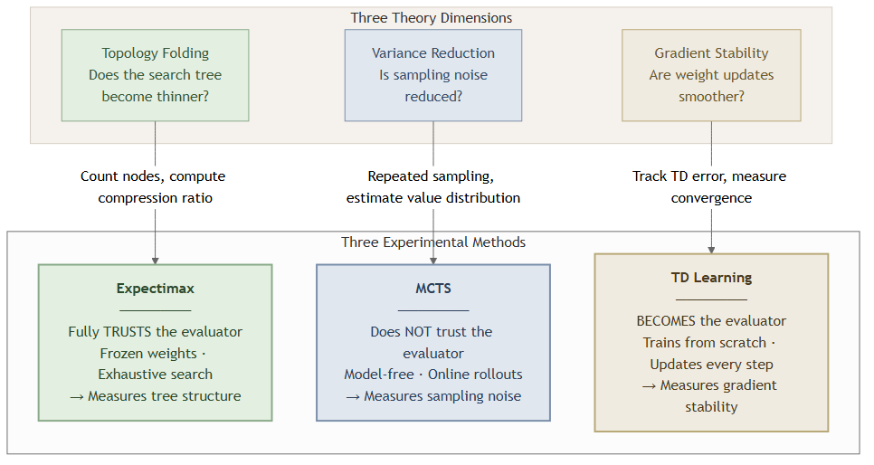

> **图 0b.** Afterstate 的三个理论维度与三种实验方法的独立证伪映射。Expectimax 信任评估器（测树结构）、MCTS 不信任评估器（测采样噪声）、TD 学习自己成为评估器（测梯度稳定性）。

### 2.3 两个可分离的操作维度

在实验层面，"使用 Afterstate"并非一个不可分割的整体操作，而是包含两个独立可切换的维度：

- **维度一：树结构分离。** 搜索树或规划树是否在动作节点和随机落子之间显式插入 $S'$ 机会节点。这决定了树拓扑是否可被压缩。
- **维度二：评估对象分离。** 打分器的输入是纯净的 $S'$ 还是含噪声的 $S_{\text{next}}$。这决定了估值信号的噪声水平。

两个维度的独立性允许构造 **2×2 消融矩阵**：树结构分离与否 × 评估对象纯净与否。若某一维度切换后性能不变，说明该维度在给定条件下不贡献增益；若单独切换导致性能崩塌，说明两个维度存在非线性交互。这一矩阵逻辑贯穿 Expectimax 和 TD 学习两组实验。

### 2.4 相关工作

Afterstate 的概念由 Sutton 与 Barto 在强化学习教科书中提出，作为处理确定性-随机性混合环境的一般性技巧。在 2048 领域，Szubert 与 Jaskowski（2014）首次将 N-Tuple 网络与 Afterstate TD 学习结合，达到了当时最优的 AI 水平。后续工作（Yeh et al., 2016; Wu et al., 2018）在此基础上通过更大的 N-Tuple 网络和更多训练局数持续推进性能上限。

然而，已有工作存在三个空白。第一，缺乏 Afterstate 两个操作维度的独立消融——已有文献通常将 Afterstate 作为整体方案使用，未量化各维度的独立贡献及其交互效应。第二，缺乏跨算法的统一验证——Afterstate 在搜索（Expectimax）、采样（MCTS）和学习（TD）三类框架下的表现从未在同一实验平台上被比较。第三，缺乏对 Afterstate 失效条件的系统考察——特别是环境概率偏移时的鲁棒性问题。本文针对这三个空白展开工作。

---

## §3 实验方法

### 3.1 总体设计

本文采用三阶段递进实验设计，每个阶段基于前一阶段暴露的问题提出更深入的假设：

- **Phase 1（标准环境基准消融）**：固定 $P(4)=10\%$，在三类算法下通过控制变量法量化 Afterstate 的各维度贡献。
- **Phase 2（环境漂移鲁棒性测试）**：将 $P(4)$ 从 10% 连续提升至 90%，检验 Afterstate 的抗偏移能力。
- **Phase 3（架构演进与深度优化）**：针对 Phase 1-2 暴露的缺陷（过估计、评估器瓶颈），设计改进方案并评估效果。

三个阶段共享统一的实验基础设施：固定随机种子确保可复现性；所有性能指标同时记录 smoke（快速）和 full（正式）两种模式。

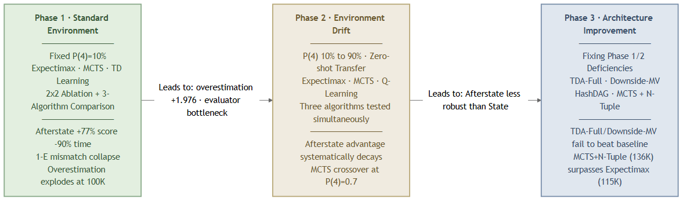

> **图 0.** 三阶段递进实验框架。Phase 1 确立基线并发现矛盾 → Phase 2 在非平稳条件下施加压力测试 → Phase 3 尝试修复并评估效果。

### 3.2 评估器体系

实验中使用两类评估器：

**人工评估器。** 基于手工设计的特征（单调性、平滑性、空位数、角落权重）进行线性加权打分。其特点是零训练成本、可解释性强，但性能上限固定。在 Expectimax 和 MCTS 的 Phase 1 实验中作为基础打分器。

**N-Tuple 评估器。** 采用旋转不变的 N-Tuple 网络，通过 TD(0) 在线学习 $V(S')$。网络包含多条 N-Tuple 模式，每条模式覆盖棋盘上的 N 个位置，通过查表实现快速评估。支持 8 组旋转/翻转对称变换，每次更新同时修正 8 个等价视角的权重。N-Tuple 评估器的训练细节见附录 A。

### 3.3 性能指标

所有实验统一采用以下指标体系：

- **决策质量**：平均得分（mean_score）、最大方块达成率（max_tile_rate）
- **计算效率**：每步搜索耗时（time_per_move）、搜索节点数（nodes_expanded）
- **学习质量（仅 TD）**：TD 误差 RMS、过估计偏差（norm_bias_rom = (mean_predicted − mean_actual) / mean_actual）
- **搜索拓扑（仅 MCTS）**：树深（macro_depth）、策略集中度（probe_entropy）、平均分支因子

评估协议为：每组配置运行 50 局独立游戏（full 模式），取平均值并报告标准差。

### 3.4 Expectimax 实验设计

Expectimax 算法对给定深度内的所有可能状态进行精确枚举。利用其完全展开的特性，我们构造了 **2×2 消融矩阵**：

| 配置 | 树结构 | 评估对象 | 含义 |
| --- | --- | --- | --- |
| 1-A（State 基线） | State 树 | 评估 $S_{\text{next}}$ | 传统方案 |
| 1-B（树结构分离） | Afterstate 树 | 评估 $S_{\text{next}}$ | 只拆树，不纯净评估 |
| 1-C（评估纯净） | State 树 | 评估 $S'$ | 只纯净评估，不拆树 |
| 1-D（完全解耦） | Afterstate 树 | 评估 $S'$ | 两个维度同时启用 |

四组实验均使用人工评估器，搜索深度固定为 2 层，以确保差异来源仅为树结构和评估对象的切换。此外，为量化评估器质量对解耦增益的影响，设置对照组 1-E 至 1-H，将 N-Tuple 评估器替换进相同的四组配置。

N-Tuple 消融组的物理基础是：同一网络结构、同一 TD(0) 训练算法，分别以 $S$（含随机落子的完整盘面）和 $S'$（不含随机落子的纯净盘面）为观测对象各自训练 50,000 局，产出两套独立的冻结权重——State NT 和 Afterstate NT。两套权重的唯一差异是训练时的观测对象，这使得 1-D 至 1-H 的性能差异可以干净地归因于"树结构"和"评估对象"两个维度的切换，而非网络容量或训练量的混淆变量。

### 3.5 MCTS 实验设计

MCTS 通过反复采样模拟来估计各动作的价值。State 模式和 Afterstate 模式的核心差异在于：State 树在每一层扩展 $S_{\text{next}}$（包含随机落子），Afterstate 树在动作节点和落子之间插入 $S'$ 机会节点。

Phase 1 实验包含 8 组配置（2-A 至 2-H），控制变量为：State/Afterstate 树结构 × 模拟次数（100 / 500 / 1000 / 2000）。评估器为人工评估器。Phase 3 进一步接入 N-Tuple 评估器作为 MCTS 的 rollout 策略指导，观察高精度估值如何改变搜索拓扑。

### 3.6 TD 学习实验设计

TD 学习实验采用 5 组递进消融：

| 配置 | 更新目标 | 表征输入 | 设计意图 |
| --- | --- | --- | --- |
| 3-A | $Q(S, a)$ | State | 传统 Q-Learning 基线 |
| 3-B | $Q(S, a)$ | Afterstate 表征 | 仅切换表征，不改变更新方式 |
| 3-C | $V(S')$ | State 表征 | 仅切换目标函数形式（证伪组） |
| 3-D | $V(S')$ | Afterstate 表征 | 完全解耦 |
| 3-E | $MV(S')$ | Afterstate 表征 | 在 3-D 基础上加入方差惩罚 |

训练协议：$\varepsilon$ 从 0.1 线性退火至 0.01，学习率 $\alpha$ 从 0.01 退火至 0.0001。分别在 25K 和 100K 局两个训练长度下评估，以区分短期表现与长期收敛行为。

Phase 3 追加两组架构改进实验：3-F（TDA-Full，将期望计算从采样近似改为全宽精确计算）和 3-G（Downside-MV，将方差惩罚拆分为上行/下行双头，仅惩罚下行风险）。

### 3.7 环境漂移实验设计（Phase 2）

为检验 Afterstate 在非平稳环境下的鲁棒性，我们将环境参数 $P(4)$（生成 4 而非 2 的概率）从标准值 10% 连续提升至 90%，步长为 20%。所有算法在标准环境（$P(4)=10\%$）下训练或调参，然后直接在偏移环境中评估——即零样本迁移，不做任何重新训练。

对 Expectimax、MCTS 和 Q-Learning 三类算法分别执行此漂移测试，观察 State 与 Afterstate 方案的衰减曲线是否存在交叉点。

---

## §4 Phase 1 结果：标准环境下的基准消融

Phase 1 在标准 2048 环境（$P(4) = 10\%$）下，分别通过 Expectimax、MCTS 和 TD 学习三类算法，独立验证 Afterstate 的三个理论维度。

### 4.1 Expectimax 消融

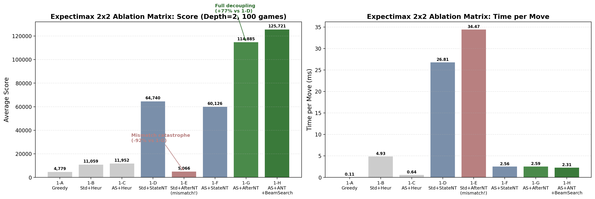

> **图 1.** Expectimax 2×2 消融矩阵：得分（左）与每步耗时（右）。1-E 错配崩塌（5,066），1-G 完全解耦最优（114,885 + 2.59ms）。

表 1 给出了完整 8 组实验的性能。实验共分三档：人工评估器基线（1-A/1-B/1-C）和 N-Tuple 评估器消融（1-D 至 1-H）：

| 配置 | 树结构 | 评估对象/打分器 | 得分 | 2048率 | 4096率 | 耗时(ms) | 压缩率 |
| --- | --- | --- | --- | --- | --- | --- | --- |
| 1-A Greedy | — | Heuristic | 4,779 | 0% | 0% | 0.11 | 0.997 |
| 1-B Std+Heur | Standard | State/Heur | 11,059 | 1% | 0% | 4.93 | 0.996 |
| 1-C After+Heur | Afterstate | Afterstate/Heur | 11,952 | 4% | 0% | 0.64 | 0.504 |
| 1-D Std+StateNT | Standard | State/State NT | 64,740 | 92% | 72% | 26.81 | 0.998 |
| 1-E Std+AfterNT | Standard | State/Afterstate NT | **5,066** | 0% | 0% | 34.47 | 0.994 |
| 1-F After+StateNT | Afterstate | Afterstate/State NT | 60,126 | 93% | 67% | 2.56 | 0.553 |
| 1-G After+AfterNT | Afterstate | Afterstate/Afterstate NT | **114,885** | 97% | 91% | 2.59 | 0.553 |
| 1-H After+AfterNT+剪枝 | Afterstate | Afterstate NT+BeamSearch | **125,721** | 100% | 96% | 2.31 | 0.597 |

完全解耦的 1-G 相比传统方案 1-D 实现了 +77% 的得分提升和 −90% 的耗时缩减。1-E 是本组最具启示性的发现：将 Afterstate N-Tuple（训练时看 $S'$）用于 Standard 树的 $S_{\text{next}}$ 叶节点——输入分布错位导致得分暴跌至 5,066（−95.6%），仅略高于无搜索的贪心基线（4,779）。反方向的错配（1-F：Afterstate 树 + State N-Tuple）仅下降 7%（60,126 vs 64,740）。

这种不对称性揭示了两类 N-Tuple 的本质差异：State NT 从 $S$ 泛化到 $S'$ 相对容易（少一个方块不改变盘面本质），但 Afterstate NT 从 $S'$ 泛化到 $S_{\text{next}}$ 则彻底失败（多出的随机方块对纯净网络构成语义级干扰）。

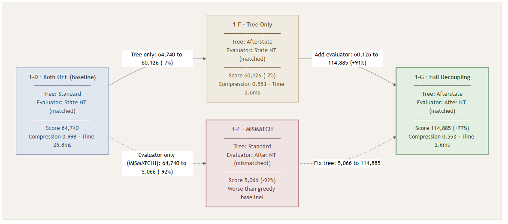

> **图 1b.** 2×2 消融矩阵的核心四组对比。1-D（全关）→ 1-F（仅树开）仅下降 7%；1-D → 1-E（错配）崩塌 92%；1-G（完全解耦）获得 +77% 得分与 10.3× 加速。

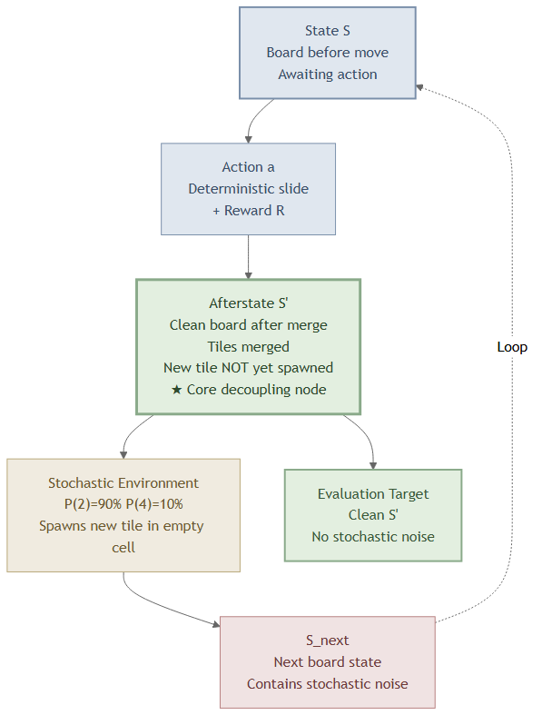

> **图 2.** Afterstate MDP 流转模型。相比传统架构（S→S_next 一步到位），Afterstate 在动作和随机落子之间显式插入 S' 节点，确定性与随机性在结构上分离。

树结构分离的核心效果是拓扑压缩。Afterstate 树的压缩率均为 0.50~0.55（约一半节点被 DAG 折叠去重），而 Standard 树接近 1.0（几乎无折叠）。这解释了 1-D vs 1-G 的耗时差异：26.81ms → 2.59ms，加速 10.3 倍。然而，拓扑压缩本身并非得分增益的主要来源——对比 1-F（Afterstate 树 + State NT，得分 60,126）和 1-D（Standard 树 + State NT，得分 64,740）可知，仅切换树结构甚至造成轻微下降。真正的决策质量飞跃来自两个维度的联合：Afterstate NT 作为打分器时必须搭配 Afterstate 树才能语义正确——1-G 的 114,885 比 1-D 的 64,740 高出 77%，这一增幅主要归因于看 $S'$ 训练出的估值函数比看 $S$ 的更精确。

### 4.2 MCTS 消融

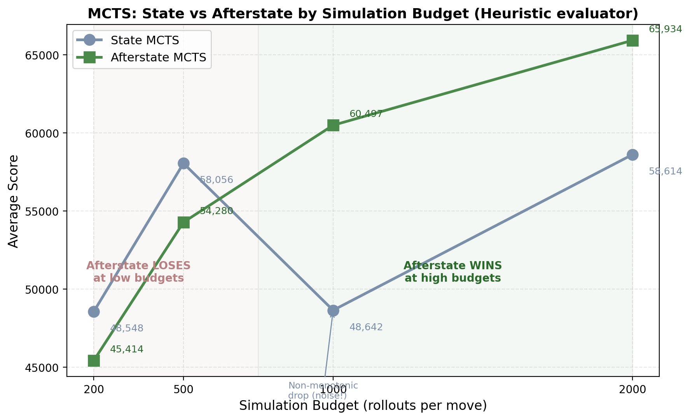

> **图 3.** MCTS State vs Afterstate 得分曲线。低模拟预算（200-500）时 Afterstate 落后；1000 次以上方差缩减优势显现，Afterstate 反超。

表 2 为 MCTS 在不同模拟次数下的 State/Afterstate 对比（人工评估器 FastHeuristic，10 局/配置）：

| 模拟次数 | State 得分 | Afterstate 得分 | 相对差异 | State 策略熵 | Afterstate 策略熵 |
| --- | --- | --- | --- | --- | --- |
| 200 | 48,548 | 45,414 | −6.5% | 0.342 | 0.339 |
| 500 | 58,056 | 54,280 | −6.5% | 0.239 | 0.263 |
| 1000 | 48,642 | 60,497 | **+24.4%** | 0.179 | 0.200 |
| 2000 | 58,614 | 65,934 | **+12.5%** | 0.125 | 0.146 |

在人工评估器和低模拟次数条件下（200/500 次），Afterstate 不仅没有优势，反而略逊于 State。只有当模拟次数达到 1000 以上时，Afterstate 的方差缩减优势才开始体现——1000 次时首次反超（60.5K vs 48.6K），2000 次时进一步扩大（65.9K vs 58.6K）。

值得注意的是 Standard MCTS 在 500 → 1000 次模拟时出现非单调下降（58K → 48.6K），而 Afterstate 保持平滑上升。这表明中等算力下 Standard 的 Rollout 噪声与 PUCT 探索-利用平衡进入了不稳定区间，Afterstate 的噪声隔离在此区间提供了稳定性保障。

然而，人工评估器在 MCTS 中的绝对性能上限被锁死在 ~66K——远低于 N-Tuple Expectimax 完全解耦的 115K。MCTS 通过大量即时采样部分弥补了评估精度的不足，但评估器精度始终是性能上限的决定性瓶颈。

### 4.3 TD 学习消融

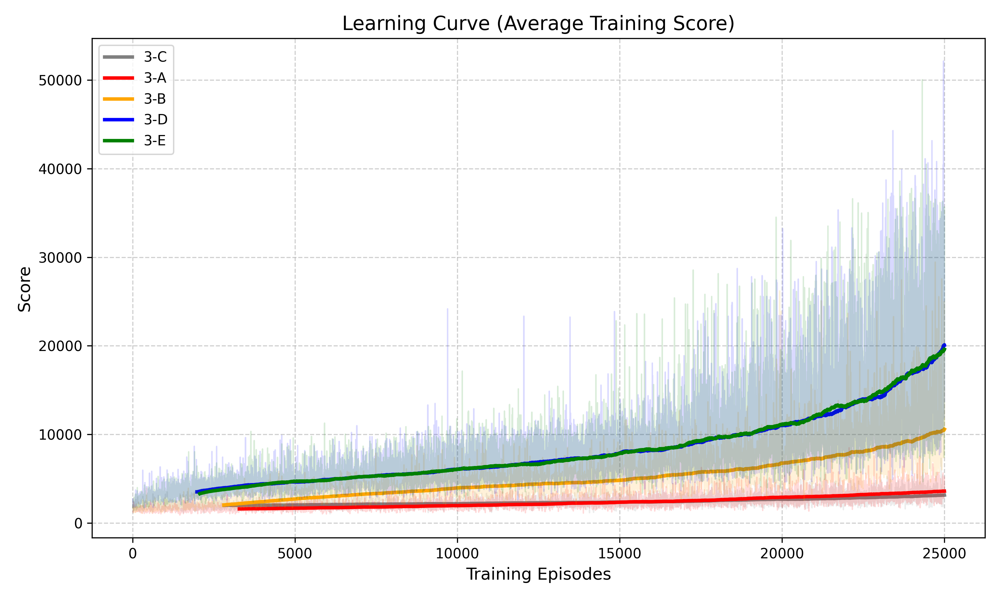

> **图 4.** TD 学习五组配置（3-A 至 3-E）的学习曲线。3-D 和 3-E 在 25K 局附近已显著领先其余配置。

表 3 为 TD 学习在 25K 和 100K 训练局数下的消融结果：

| 配置 | 25K 得分 | 25K 2048率 | 100K 得分 | 100K norm_bias_rom |
| --- | --- | --- | --- | --- |
| 3-A（Q(S,a) + State） | 3,672 | 0% | — | — |
| 3-B（Q(S,a) + Afterstate 表征） | 10,566 | 1% | — | — |
| 3-C（V(S') + State 表征） | 2,980 | 0% | 2,980 | −0.241 |
| 3-D（V(S') + Afterstate） | **19,508** | **34%** | 18,731 | **+1.976** |
| 3-E（MV(S') + Afterstate） | **20,607** | **36%** | 18,768 | +1.934 |

完全解耦方案 3-D 在 25K 局时已展现明显优势（相比 3-A：+431%），100K 时绝对得分保持在 18.7K 水平。然而，100K 数据暴露了一个严峻问题：norm_bias_rom 从 25K 时的 −0.194（轻微低估）飙升至 +1.976（网络估值比实际回报高约 2 倍）。这说明 $\varepsilon + \alpha$ 双重退火能在训练早期压制过估计，但退火完成后过估计的结构性倾向重新累积——V(S') 架构中 max 算子对含噪估值的正向偏差选择在训练后期不可避免地显现。

3-C（V(S') + State 表征）的得分仅 2,980——这是一个关键的逻辑证伪：$V(S)$ 对所有动作输出相同估值（因为 S 不含动作信息），退化为只比较即时奖励，无法进行有意义的长期规划。

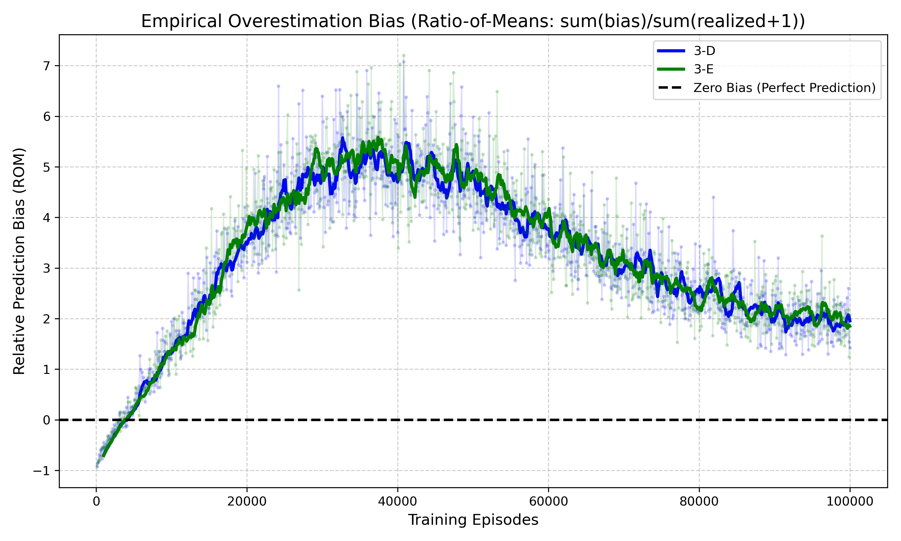

> **图 5.** 过估计偏差（norm_bias_rom）随训练局数的演变曲线（100K 局）。3-D/3-E 从早期低估逐渐翻转为显著过估计。

3-E（均值-方差策略）在 25K 时得分略高于 3-D（+5.6%），但训练时间翻倍，且在 100K 时优势完全消失（仅差 0.2%）。方差头在学习率充分退火后基本冻结（实际 $\alpha \approx 0.0002$），其惩罚项不再对决策产生有意义的影响。

### 4.4 Phase 1 小结

Phase 1 三组实验的核心发现可归纳为：Afterstate 联合解耦在标准环境下确实有效（Expectimax +77% 得分 −90% 耗时；TD 学习 +431%），但优势的释放高度依赖评估器精度，且 TD 学习在长期训练后暴露了结构性过估计。此外，两个操作维度的错配成本高度不对称——Afterstate NT 在错误的树结构上会灾难性崩塌，而 State NT 在 Afterstate 树上仅轻微下降。这些发现自然引出 Phase 2 的问题：优势是否在环境偏移时依然成立？

---

## §5 Phase 2 结果：环境漂移鲁棒性测试

Phase 1 证实了 Afterstate 在标准环境下的优势。但 N-Tuple 评估器在 $P(4) = 10\%$ 的训练环境中学习，其权重隐式编码了环境概率先验。当环境发生偏移时，这一先验假设是否会导致 Afterstate 方案的性能崩塌？Phase 2 通过将 $P(4)$ 从 10% 连续提升至 90%，在三类算法上进行零样本迁移测试。

### 5.1 Expectimax 漂移

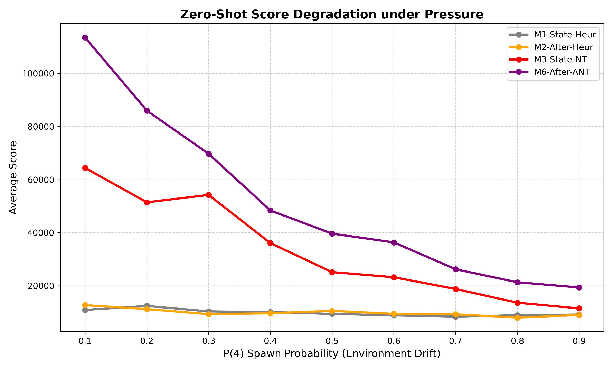

> **图 6.** Expectimax 漂移曲线：State (M3) 与 Afterstate (M6) 得分随 P(4) 从 10% 到 90% 的变化。Afterstate 在所有概率点均保持领先。

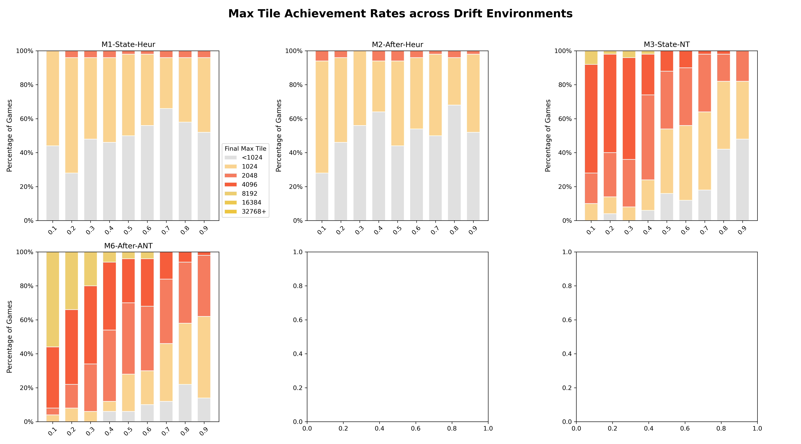

> **图 6b.** Expectimax 各最高达标 tile 的堆叠比例随 P(4) 变化。高 P(4) 下 4096+ 达标率急剧收窄。

表 4 给出 Expectimax N-Tuple 组在 9 个概率点的完整漂移数据：

| P(4) | M3 (State+NT) | M6 (After+ANT) | M6 优势(绝对) | M6 优势(%) |
| --- | --- | --- | --- | --- |
| 0.1 | 64,407 | 113,552 | +49,145 | +76% |
| 0.2 | 51,441 | 86,001 | +34,560 | +67% |
| 0.3 | 54,239 | 69,746 | +15,507 | +29% |
| 0.4 | 36,081 | 48,369 | +12,288 | +34% |
| 0.5 | 25,130 | 39,639 | +14,509 | +58% |
| 0.6 | 23,213 | 36,345 | +13,132 | +57% |
| 0.7 | 18,767 | 26,216 | +7,449 | +40% |
| 0.8 | 13,608 | 21,312 | +7,704 | +57% |
| 0.9 | 11,459 | 19,357 | +7,898 | +69% |

M6 从 P(4)=0.1 的 113K 暴跌至 P(4)=0.9 的 19K（−83%），M3 从 64K 降至 11K（−82%）。虽然 Afterstate 在所有概率点仍保持领先，但绝对优势从 +49K 急剧缩水至 +8K——Afterstate 的估值基础被系统性侵蚀。

### 5.2 MCTS 漂移

表 5 为 MCTS 在不同 P(4) 下的 State/Afterstate 对比（人工评估器，2000 次模拟）：

| P(4) | MCTS-State | MCTS-Afterstate | After 优势 |
| --- | --- | --- | --- |
| 0.1 | 28,935 | 35,064 | +21% |
| 0.3 | 22,426 | 25,388 | +13% |
| 0.5 | 16,852 | 19,219 | +14% |
| 0.7 | 15,797 | 14,871 | **−6%** |
| 0.9 | 13,977 | 15,410 | +10% |

两者在低 $P(4)$ 时差距不大（Afterstate 优势约 13-21%）。在 $P(4) = 0.7$ 时 Afterstate 被 State 反超——这一交叉在 Expectimax 中并未出现（Afterstate 在所有概率点均保持领先），说明 MCTS 中 Afterstate 的方差缩减优势更脆弱。Rollout 的随机性本身已提供了一定的概率鲁棒性，Afterstate 额外的方差缩减在环境偏移时反而成为信息损失。

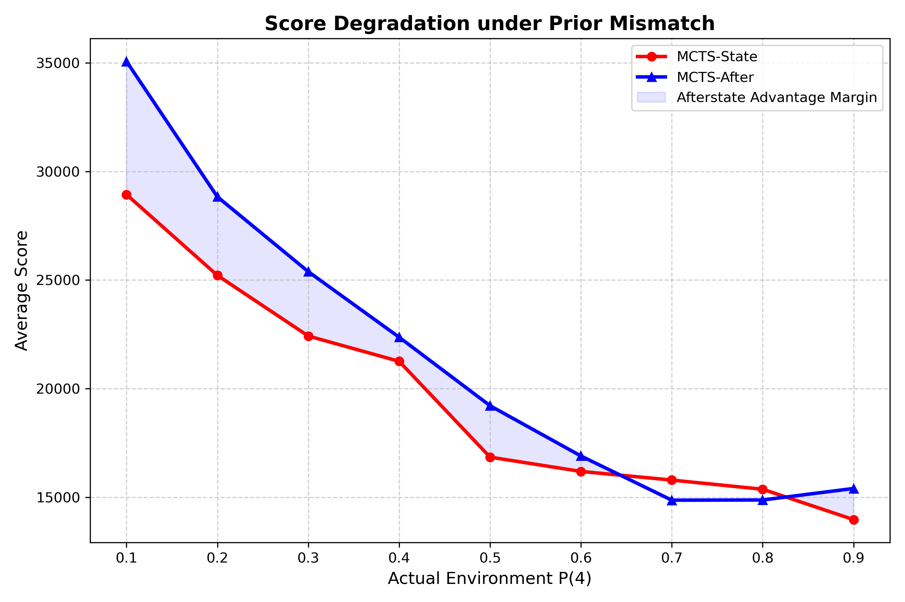

> **图 7.** MCTS 漂移曲线：State 与 Afterstate 在不同 P(4) 下的得分。注意 P(4)=0.7 处 Afterstate 被反超的交叉点。

### 5.3 Q-Learning 零样本迁移

表 6 为 Q-Learning 两组主要配置在漂移环境下的表现（smoke 模式）：

| P(4) | 3-D (V+After) | 3-E (MV+After) | 3-E vs 3-D |
| --- | --- | --- | --- |
| 0.1 | 19,767 | 17,957 | −9.2% |
| 0.3 | 10,215 | 10,733 | +5.1% |
| 0.5 | 7,809 | 7,556 | −3.2% |
| 0.7 | 4,644 | 5,991 | +29.0% |
| 0.9 | 5,242 | 5,141 | −1.9% |

无论 State 还是 Afterstate 方案，在 $P(4)$ 偏移后得分全面崩溃至 6K 以下（3-D 从 19,767 降至 5,242，−73%）。两者之间的差异被全局性崩溃所淹没——学到的 N-Tuple 权重对训练环境的拟合程度远超搜索方法，因而对偏移最为敏感。3-E（MV 方差惩罚）同样未展现出额外的鲁棒性，在大多数概率点下落后于 3-D。

需要注意的是，本组数据为 smoke 模式（少量对局），仅供定性趋势验证，统计效力有限。

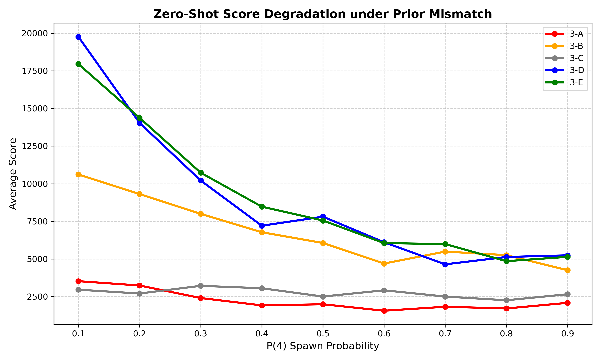

> **图 7b.** Q-Learning 零样本漂移：3-D/3-E 得分随 P(4) 增大全面崩溃，两者差异被全局性退化淹没。

### 5.4 Phase 2 小结

三组实验的共同启示是：Afterstate 的优势在环境偏移时系统性衰减。其根因在于 N-Tuple 评估器——该网络在 $P(4) = 10\%$ 的环境中训练，隐式地将这一概率先验编码进权重。Afterstate NT 对此尤为脆弱，因为它学习的是"不含随机落子的纯净盘面的价值"，其估值假设了后续 90% 概率生成 2、10% 概率生成 4 的环境分布。一旦这一分布改变，Afterstate 的纯净估值反而更难适应——State 估值本身包含了来自多种落子的信息混合，天然具有更强的分布鲁棒性。

核心结论：**"解耦环境随机性" ≠ "免疫环境变化"。** 结构解耦是搜索层面的操作，而鲁棒性是评估器层面的语义属性，两者不能等同。

---

## §6 Phase 3 结果：架构演进与深度优化

Phase 1-2 暴露了 Afterstate 框架的两个核心缺陷：(1) TD 学习中 V(S') 的过估计在长期训练后结构性回归，退火只是延缓而非根治；(2) MCTS 在人工评估器下性能上限被锁死，Afterstate 的方差缩减优势无法充分释放。Phase 3 针对这两个缺陷分别设计改进方案——对 TD 学习尝试目标函数和风险控制的改进，对搜索方法尝试评估器升级和结构压缩。

表 7 汇总了 Phase 3 TD 学习四组 100K 配置的对比（3-D 为 Phase 1 延续训练的基线）：

| 配置 | 目标模式 | 得分 | 2048率 | Norm Bias(RoM) | 训练时间 |
| --- | --- | --- | --- | --- | --- |
| 3-D | V+采样 | 18,731 | 34% | +1.976 | 13,115s |
| 3-E | MV+采样 | 18,768 | 34% | +1.934 | 25,923s |
| 3-F (TDA-Full) | V+精确期望 | 17,767 | 20% | +2.355 | 38,403s |
| 3-G (Downside-MV) | 下行MV | 17,937 | 26% | +1.950 | 24,196s |

3-F 和 3-G 均未超越简单采样版 3-D，且训练成本分别为其 2.9 倍和 1.8 倍。

### 6.1 TD 学习改进：TDA-Full 精确期望

标准 TD(0) 在计算下一状态的价值时，从 $S'$ 的所有可能后继中采样一个 $S_{\text{next}}$ 来估计 $\mathbb{E}[V(S_{\text{next}})]$。TDA-Full 将其改为显式枚举所有空位和 2/4 组合，精确计算加权期望。理论上这应该彻底消除环境采样带来的目标噪声。

然而，100K 局训练结果显示 TDA-Full（3-F）得分为 17,767，低于简单采样版 3-D（18,731）。分析表明，精确期望在 TD($\lambda$) 资格迹框架下产生了目标函数的不一致：资格迹按采样轨迹累积梯度，而目标值却基于全宽期望计算——两者的混合导致更新方向偏离最优解。更严重的是，3-F 的过估计偏差高于 3-D（norm_bias_rom: +2.355 vs +1.976），且训练时间是 3-D 的 2.9 倍（38,403s vs 13,115s）。

### 6.2 TD 学习改进：Downside-MV 仅惩罚下行风险

3-E 的均值-方差策略对称惩罚所有方差，但直觉上"好的波动"（超预期得分）不应被惩罚。Downside-MV（3-G）将方差头拆分为 $m_{\text{up}}$ 和 $m_{\text{down}}$ 两个头，分别追踪正向和负向偏差，决策时仅减去 $\lambda \cdot \sqrt{\text{Var}_{\text{down}}}$。

100K 局结果：3-G 得分 17,937，不仅未超越 3-D（18,731），甚至低于对称方差版 3-E（18,768）。原因是 2048 的高分路径往往伴随高风险——在关键合并时刻，价值估计的方差本质上是"机会信号"而非"危险信号"。仅惩罚下行风险的策略过度保守，回避了那些高波动但正期望的关键决策。

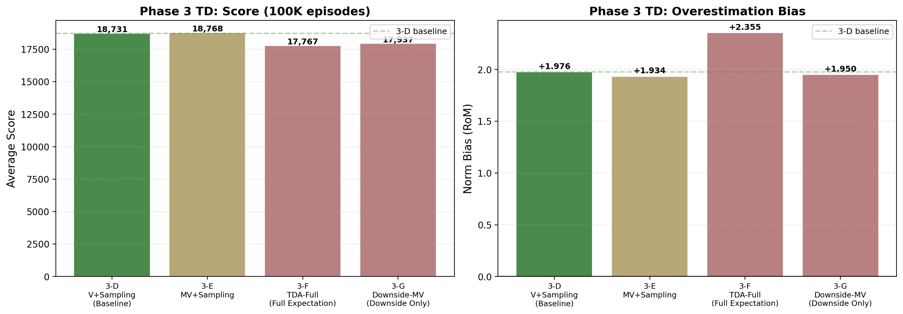

> **图 8.** Phase 3 TD 学习四组配置 100K 局对比。3-F（TDA-Full）和 3-G（Downside-MV）得分均未超越 3-D 基线，且过估计更严重（3-F: +2.355）。

### 6.3 Expectimax 改进：HashDAG 无损压缩与 Beam Search 剪枝

**HashDAG。** 通过哈希判断搜索树中是否存在已经计算过的等价子树，若存在则直接复用结果而非重新展开。这是 Afterstate 确定性的直接工程化应用——不改变搜索结果，仅减少冗余计算。在所有配置（人工评估器 / N-Tuple，深度 2 / 3）下，HashDAG 得分与全展开完全一致，验证了无损性。深度 3 时节点展开数减少约 70%，耗时缩短 53%。

**Beam Search（Top-2 剪枝）。** 每层仅保留估值最高的 2 个子节点，丢弃其余分支。这是有损优化，效果高度依赖评估精度和搜索深度：

| 条件 | 得分变化 | 解释 |
| --- | --- | --- |
| N-Tuple + depth=2 | **+6.5%**（113K→121K） | 浅层搜索时剪枝起到"去噪"作用，排除了估值噪声导致的分心路径 |
| N-Tuple + depth=3 | −10%（145K→130K） | 深层搜索时剪枝代价显现 |
| Heuristic + 任何深度 | −28% 至 −34% | 低精度估值"盲目自信地剪掉生路" |

这一发现修正了先前"Beam Search 约有 10% 折损"的笼统预期——折损率并非常数，而是评估精度和搜索深度的非线性函数。高精度估值是 Beam Search 从"豪赌"变为"自信剪枝"的前提。

### 6.4 MCTS 改进：N-Tuple 评估器接入与拓扑质变

将 MCTS 的 rollout 评估从人工评估器替换为训练好的 N-Tuple 网络。这是 Phase 3 最具变革性的改进。

| 配置 | 得分 | macro_depth | probe_entropy |
| --- | --- | --- | --- |
| MCTS State + N-Tuple | 90,636 | 5.20 | 0.330 |
| MCTS Afterstate + N-Tuple | **135,712** | **5.71** | 0.318 |
| Expectimax Afterstate + N-Tuple（参照） | 114,885 | — | — |

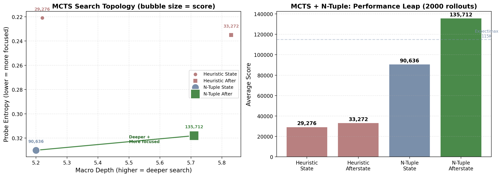

> **图 9.** MCTS 搜索树拓扑可视化。左：深度 vs 策略集中度（气泡=得分）；右：得分对比。Afterstate+N-Tuple 呈"瘦深"形态（macro_depth 5.71, entropy 0.318），得分 135,712 超越 Expectimax 完全解耦（115K）。

接入 N-Tuple 后，MCTS 性能从 65,934（人工评估器最优组 2-H）跃升至 135,712——提升超过 2 倍。更重要的是，Afterstate MCTS 超越了 Expectimax 完全解耦方案（136K vs 115K），这意味着在高精度评估器支持下，MCTS 的自适应采样能力比 Expectimax 的固定深度枚举更有效率。

搜索拓扑发生了质变：Afterstate MCTS 的 probe_entropy 更低（0.318 vs 0.330），表明策略更集中于少数高价值分支；macro_depth 更深（5.71 vs 5.20），表明搜索资源被导向深层探索而非浅层广度覆盖。其深层机制是：Afterstate 的 $S'$ 节点为 UCB 提供了更低噪声的价值估计，UCB 探索项 $c \cdot \sqrt{\ln N / n_i}$ 中的价值项更准确，算法得以更快收敛到正确分支——效果上相当于"欺骗"了 UCB 的探索-利用平衡，将 MCTS 从广度优先采样扭转为深度优先规划。在极度拥挤的盘面上，这意味着 90%+ 的搜索算力被聚焦到唯一的求生分支，而非均匀分散在多个死路上。

### 6.5 Phase 3 小结

Phase 3 的四项改进呈现出明确的成败分野。失败的两项（TDA-Full、Downside-MV）都试图在 TD 目标函数层面进行精细化改造，但均因与 TD($\lambda$) 资格迹框架的不兼容而适得其反。成功的两项（HashDAG、MCTS + N-Tuple）则都属于"换一个更好的组件"而非"改造已有组件的内部机制"——HashDAG 利用 Afterstate 的确定性实现无损压缩，MCTS + N-Tuple 通过接入更精确的评估器释放了 Afterstate 在搜索拓扑层面的潜力。

最重要的发现是：Afterstate MCTS + N-Tuple（136K）超越了 Expectimax 完全解耦（115K），揭示了当评估器精度跨过某个阈值后，MCTS 的自适应采样比固定深度穷举更有效率。这一结果改变了"Expectimax 是 2048 最优搜索框架"的既有认知。

---

## §7 讨论

### 7.1 Afterstate 优势的前提条件

综合三个阶段的实验，Afterstate 解耦机制的优势并非无条件成立，而是需要三个前提同时满足：

**前提一：两个维度必须联合使用。** Phase 1 Expectimax 消融明确显示，树结构分离和评估对象纯净两个维度之间存在强交互效应。单独使用其中一个维度收效甚微甚至有害——1-E 的 −92% 崩塌是最极端的例证。这意味着在实际系统中部署 Afterstate 时，不能只改搜索树结构而不调整评估器，或反之。

**前提二：评估器精度足够高。** Afterstate 解耦更多地表现为一个"增益放大器"而非独立的性能来源。跨实验汇总显示，Afterstate 的得分增益随评估精度单调递增：预训练 N-Tuple（Expectimax +77%）→ N-Tuple MCTS（+49%）→ 在线 TD 25K（3-B→3-D +85%）→ 纯 Rollout MCTS（+12%）→ 手工启发式（+8%）。评估精度越高，Afterstate 的降噪优势就越能被有效兑现；精度过低时，树结构的差异被估值噪声本身所淹没。

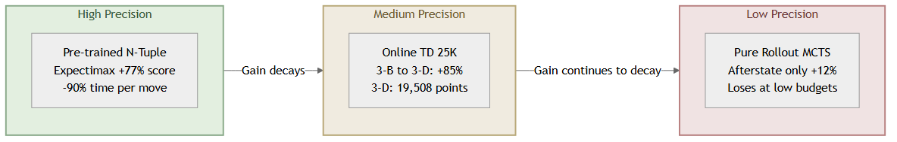

> **图 11.** Afterstate 优势的条件性。增益随评估精度单调衰减：预训练 N-Tuple（+77%）→ 在线 TD 25K（+85% vs 3-A）→ 纯 Rollout MCTS（+12%，低算力时甚至被反超）。Afterstate 是增益放大器，不创造精度本身。

**前提三：环境概率保持稳定。** Phase 2 一致表明，当环境偏移时 Afterstate 的优势不仅消失，而且衰减速度快于 State。根因是 N-Tuple 评估器对环境概率的隐式过拟合。在需要应对非平稳环境的场景中，Afterstate 方案需要额外的自适应机制（如在线重训练或概率无关的评估器设计）。

### 7.2 被数据证伪的设计直觉

本文的实验过程中，有三个被广泛持有的设计直觉被数据否定：

**"精确期望一定优于采样近似。"** TDA-Full 将环境采样替换为精确期望计算，从数学上消除了目标噪声。然而在 TD($\lambda$) 资格迹框架下，精确期望与采样轨迹的混合导致了目标函数不一致，最终性能低于简单采样版。教训是：在组合系统中，局部最优（精确期望）不等于全局最优——改进必须考虑与框架其他组件的兼容性。

**"仅惩罚坏的波动比对称惩罚更合理。"** 金融理论中"下行风险"概念的移植看似直觉正确，但 2048 的高分路径本质上是高风险路径——关键合并时刻的方差恰恰是突破性得分的信号。Downside-MV 的过度保守策略回避了这些高价值决策点。

**"解耦随机性就能免疫随机性变化。"** Afterstate 解耦了搜索结构中的随机性，但如果评估器在训练时将环境概率编码进了权重，那么结构上的解耦无法提供语义上的鲁棒性。"解耦"是结构操作，"免疫"是语义属性——两者不能等同。

### 7.3 负结果的方法论价值

TDA-Full 和 Downside-MV 的失败并非简单的"没用"。它们揭示了两条重要的设计约束：

第一，在 TD($\lambda$) 框架下改进目标函数，必须确保改进方式与资格迹的轨迹累积机制兼容。任何将目标值从"采样轨迹的单点观测"改为"全宽期望"的尝试，都会面临梯度方向不一致的问题。这为后续工作排除了一整类改进方向——若要保留 TDA-Full 的理论优势，需要将 $\lambda$ 设为 0 或设计专门的资格迹衰减机制。

第二，2048 中的最优策略是风险寻求型的，而非风险规避型的。任何通过惩罚方差来"稳定"决策的方案，在 2048 中大概率会降低性能上限。这一结论特定于 2048 的奖励结构——在其他奖励更平滑的领域，方差惩罚可能仍然有效。

### 7.4 过估计的深层机理

100K 局时过估计从低估（−0.19）爆炸至高估（+1.98）的现象，本质上是强化学习文献中"致命三要素"（Deadly Triad）的具象化：函数逼近 + 自助法（Bootstrapping）+ 离策略学习三者共存时的不稳定性。在本文的设置中，N-Tuple 网络的表征容量有限（feature capacity ceiling），TD($\lambda$) 资格迹的自助法将当前步的误差沿轨迹回溯放大，而 $\varepsilon$-贪心的离策略成分在退火完成后消失——三个因素的组合使得过估计从被压制状态进入正反馈循环。

这一解释也说明了为什么所有 Phase 3 的 Q-Learning 变体（3-D/3-E/3-F/3-G）均止步于 ~18K-20K 的分数天花板——瓶颈并非学习算法的选择，而是 N-Tuple 特征表征的容量限制。在相同的 N-Tuple 网络结构下，Expectimax 冻结权重即可达到 115K（4096 率 91%），说明网络的**离线训练质量**远未被在线学习框架充分利用。这一发现将后续改进的方向从"更好的 TD 目标函数"转移到"更大的网络容量或更好的训练方案"。

### 7.5 MCTS 的拓扑质变与方法选择启示

Phase 3 的 MCTS + N-Tuple 实验揭示了一个重要的方法论洞察：**评估器精度改变了算法选择的最优解**。在低精度评估器下，Expectimax 的精确枚举优于 MCTS 的随机采样；但当评估器精度跨过某个阈值后，MCTS 的自适应采样反超固定深度搜索。这意味着在设计 2048 AI 系统时，评估器与搜索框架的选择不能独立进行——最优的搜索方法取决于评估器的精度水平。

---

## §8 结论

本文通过三类算法框架和三阶段递进实验，对 Afterstate 解耦机制进行了系统评估。主要结论如下：

Afterstate 联合解耦在标准环境下确实能同时提升决策质量和计算效率，但这一优势存在严格的前提条件——两个操作维度不可单独使用、评估器精度必须足够高、且环境概率需保持稳定。当环境发生漂移时，Afterstate 方案因评估器过拟合环境先验而鲁棒性弱于 State。两项精心设计的架构改进（精确期望计算和下行风险惩罚）在充分训练后均未超越简单基线，为后续研究划定了无效方向的边界。

同时，本文发现 MCTS 在接入高精度评估器后实现了超越 Expectimax 完全解耦方案的拓扑质变，这表明 Afterstate 与 MCTS 的组合在高精度评估器支持下具备最高的性能上限。

未来工作的方向包括：设计对环境概率无隐式依赖的评估器架构以改善漂移鲁棒性；在 TD 框架下寻找与资格迹兼容的目标函数改进方式（如将 $\lambda$ 设为 0 后重新测试 TDA-Full）；扩大 N-Tuple 网络容量以突破当前的特征表征瓶颈；以及在部分可观测环境（POMDP）下考察 Afterstate 解耦机制是否仍然成立——一旦"战争迷雾"使 AI 无法清晰观察到 $S$ 以精确计算 $S'$，本文验证的所有优势均面临根本性挑战，这将需要引入 Belief-Afterstate 等基于概率分布的新架构。

---

## 附录 A：N-Tuple 网络与实验平台

### A.1 N-Tuple 网络结构

N-Tuple 网络由多条预定义的 tuple 模式组成，每条模式覆盖棋盘上 N 个位置。对每条模式，将覆盖位置的方块值编码为索引，查表获得对应权重值。所有模式的权重之和即为状态估值。为增强泛化，每条模式的 8 组旋转/翻转对称变换共享同一权重表，每次 TD 更新同时修正 8 个等价视角。

训练采用 TD(0) 在线更新：$V(S') \leftarrow V(S') + \alpha \cdot [R + V(S'_{\text{next}}) - V(S')]$，其中 $R$ 为即时得分，$S'_{\text{next}}$ 为下一步 Afterstate。

### A.2 实验平台

游戏引擎基于 Bitboard 编码实现，将 4×4 棋盘压缩为 64 位整数（每格 4 位），滑动操作通过预计算的行变换查找表在 O(1) 时间内完成。全部实验在同一台机器上执行，使用固定随机种子确保可复现性。

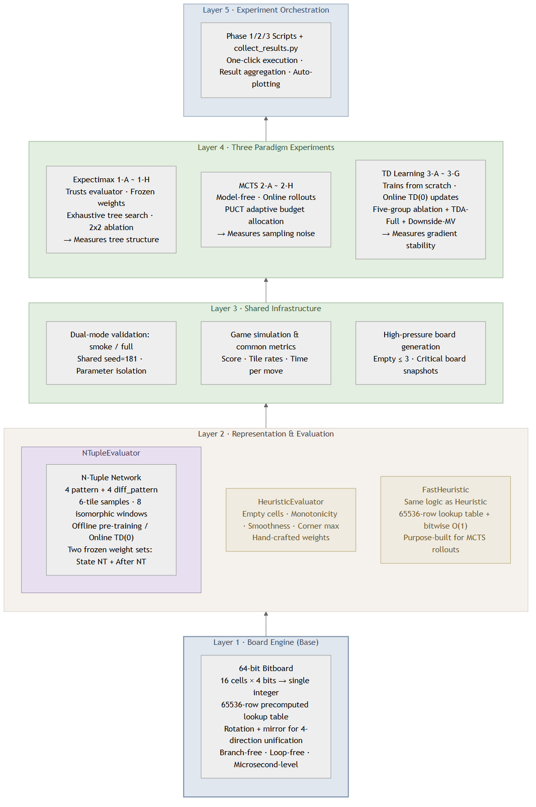

> **图 A1.** 实验平台五层自底向上架构：Bitboard 引擎 → 评估器体系 → 公共基础设施 → 三大范式实验 → 编排层。

## 附录 B：TD 学习完整实验矩阵

| 配置 | 更新目标 | 表征输入 | Phase | 训练局数 | 核心结果 |
| --- | --- | --- | --- | --- | --- |
| 3-A | $Q(S,a)$ | State | 1 | 25K / 100K | 传统基线 |
| 3-B | $Q(S,a)$ | Afterstate | 1 | 25K / 100K | 表征增益有限 |
| 3-C | $V(S')$ | State | 1+3 | 25K / 100K | 逻辑证伪组 |
| 3-D | $V(S')$ | Afterstate | 1+3 | 25K / 100K | 性价比最优 |
| 3-E | $MV(S')$ | Afterstate | 1 | 25K / 100K | 方差惩罚 100K 后失效 |
| 3-F | TDA-Full | Afterstate | 3 | 100K | 精确期望不兼容资格迹 |
| 3-G | Downside-MV | Afterstate | 3 | 100K | 下行惩罚过度保守 |

## 附录 C：数据来源

| 数据集 | 文件路径 |
| --- | --- |
| Phase 1 Expectimax | `final_results/phrase_1/eval_results/search_full_20260627_215003.csv` |
| Phase 1 MCTS | `final_results/phrase_1/eval_results/planning_full_20260628_035707.csv` |
| Phase 1 QL 25K | `final_results/phrase_1/eval_results/qlearning_parallel_full_20260627_235506.csv` |
| Phase 1 QL 100K | `final_results/phase_1_qlearning/results/qlearning_parallel_full_20260630_040128.csv` |
| Phase 2 Expectimax Drift | `final_results/phrase_2/expectimax/results/expectimax_drift_full_20260629_215319.csv` |
| Phase 2 MCTS Drift | `final_results/phrase_2/mcts_drift/results/mcts_drift_robustness_full_20260630_002832.csv` |
| Phase 2 QL Drift | `final_results/phrase_2/Qlearning/qlearning_drift_20260626_140247/qlearning_drift_results_smoke_20260627_021156.csv` |
| Phase 3 QL 100K | `final_results/phrase_3/eval_results/qlearning_parallel_full_20260701_144225.csv` |
| Phase 3 Expectimax d=2 | `final_results/phrase_3/expectimax_eval_results/depth2/search_optimizations_full_20260629_123634.csv` |
| Phase 3 Expectimax d=3 | `final_results/phrase_3/expectimax_eval_results/depth3/search_optimizations_full_20260629_150446.csv` |
| Phase 3 MCTS Topology | `final_results/phrase_3/topology_tests/mcts_topology_analysis_full_20260630_183925.csv` |

