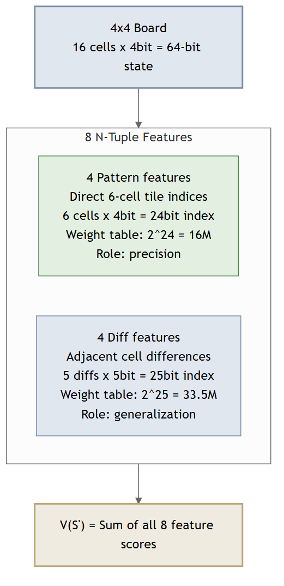
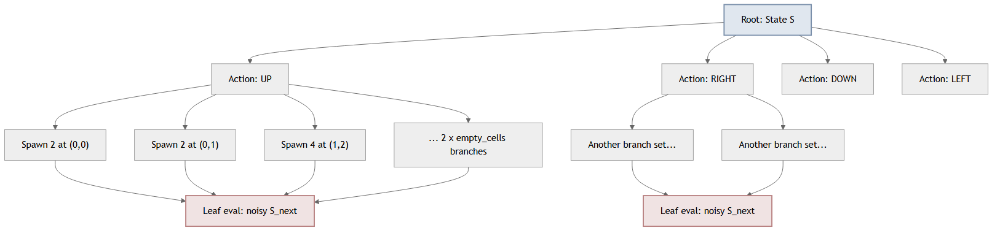
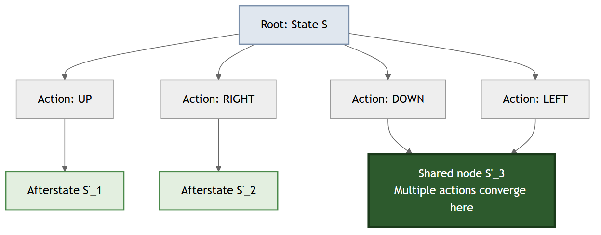
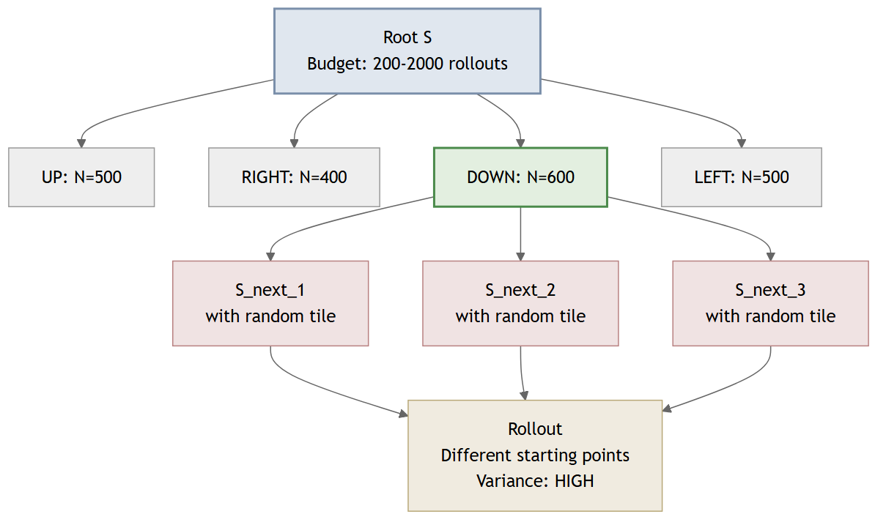
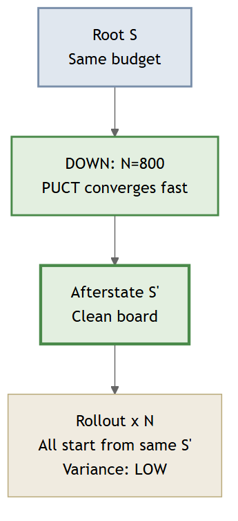
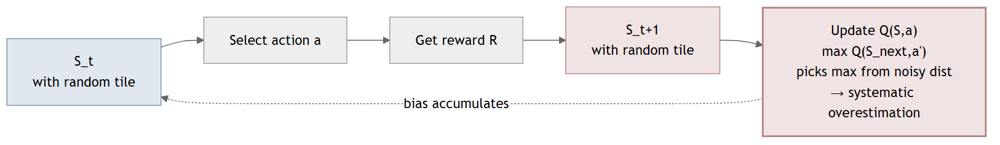
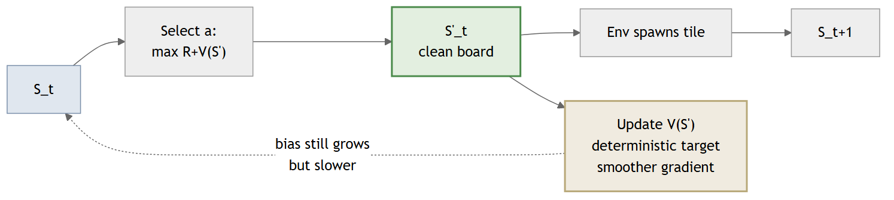
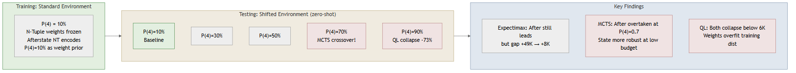
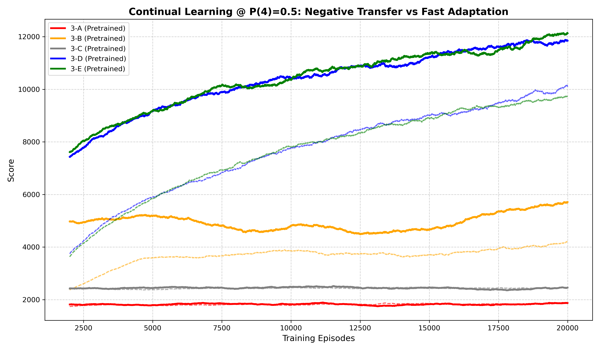
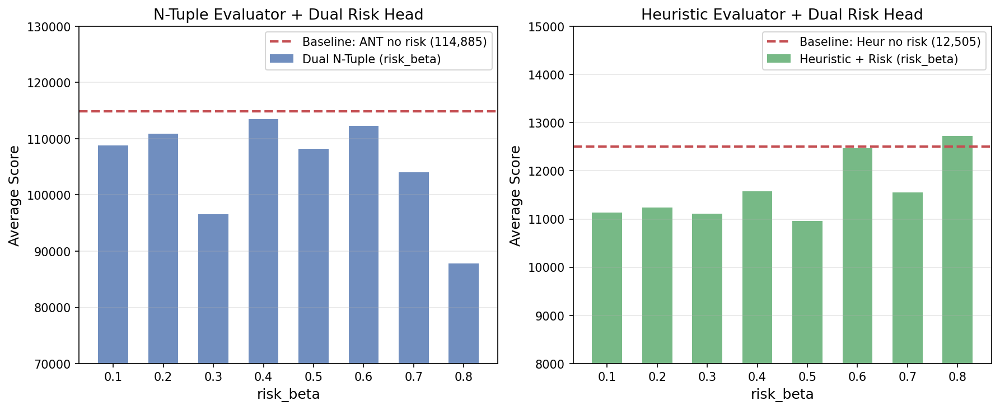

# Afterstate 解耦机制在 2048 序贯决策中的系统评估

---

## §1 引言

2048 是一个典型的随机序贯决策问题。玩家的每一步操作可分解为两个性质截然不同的子过程：玩家选择滑动方向后方块发生确定性合并，随后环境在空位随机生成新方块。传统的状态建模方式将这两个子过程合并为一步转移，从当前盘面 $S$ 直接跳转到下一回合盘面 $S_{\text{next}}$。Afterstate 建模则在两者之间显式插入一个中间状态 $S'$——滑动后、落子前的纯净盘面——从而将确定性过程与随机性过程在结构上分离。

这种解耦在理论上能带来三方面的优势：搜索树的拓扑折叠、采样方差的缩减、以及强化学习梯度的稳定。然而，这些理论声称在实践中能被多大程度地兑现？是否存在理论未能预见的失效模式？已有文献对 Afterstate 的研究多集中在单一算法框架内的性能对比，缺乏跨算法、跨环境条件的系统性验证，尤其缺乏对其**失效边界**的考察。

本文围绕三个递进的研究问题组织实验：

- **RQ1**：Afterstate 在标准环境下是否具有一致的决策质量与计算效率优势？其两个操作维度（树结构分离与评估对象纯净）是否必须联合使用？
- **RQ2**：当环境概率发生偏移时，Afterstate 的鲁棒性是否强于传统的 State 建模？
- **RQ3**：针对 RQ1 和 RQ2 暴露的缺陷，能否通过架构改进加以修复？

三个问题的逻辑递进关系为：RQ1 确立基线并发现矛盾 → RQ2 在非平稳条件下施加压力测试 → RQ3 尝试修复并评估效果。

本文的主要贡献如下。第一，通过错配实验系统验证了 Afterstate 两个操作维度（树结构与评估对象）的联合使用必要性：将在特定分布上训练的评估器应用于不匹配的输入类型会导致灾难性崩塌，且两类评估器的跨分布泛化能力高度不对称。第二，推翻了"解耦环境等同于免疫环境变化"的直觉假设——Afterstate 的 N-Tuple 权重将环境概率先验过拟合，导致其在环境漂移时鲁棒性显著弱于 State。第三，发现两类被寄予厚望的架构改进（TDA-Full 精确期望、Dual-MV 双头方差）在充分训练后均未超越简单基线，为后续研究划定了无效方向的边界。第四，揭示了 MCTS 在接入高精度评估器后发生拓扑质变，Afterstate MCTS（136K）超越了 Expectimax 完全解耦方案（115K）。

---

## §2 背景

### 2.1 问题形式化

2048 游戏的单步决策可建模为马尔可夫决策过程（MDP）。在每一步流转中，存在三个严格区分的状态节点。传统 State 建模直接学习 $Q(S, a)$ 或对 $S_{\text{next}}$ 进行搜索，将确定性与随机性糅合在一起。Afterstate 建模通过显式引入 $S'$，将搜索或学习的对象定位于确定性过程的输出端，从而在结构上隔离随机噪声。

> **图 1.** Afterstate MDP 三节点流转模型。动作执行后先抵达纯净的 S'（仅含合并结果），随后由环境随机生成新方块进入 S_next。确定性过程（蓝）与随机过程（橙）在结构上显式分离。

### 2.2 Afterstate 的三个理论优势

Afterstate 解耦的三个理论维度分别对应三类算法的核心瓶颈：

**拓扑折叠。** 在搜索树中，不同动作路径可能经历相同的合并结果而收敛到同一个 $S'$。当搜索算法能识别这种等价性时，搜索树从指数爆炸的树状结构坍缩为有向无环图（DAG），节点数大幅缩减。这一维度通过 Expectimax 搜索的精确节点计数来验证。

**方差缩减。** 评估 $S'$（不含随机落子噪声）比评估 $S_{\text{next}}$（已含噪声）的采样方差更低。当多次独立估值同一决策点时，Afterstate 方案的估值分布更集中。这一维度通过 MCTS 的重复采样统计来验证。

**梯度稳定。** 在 TD 学习中，Bellman 目标中的 max 操作作用于确定性的 $R + V(S')$ 而非含噪声的 $Q(S_{\text{next}}, a')$，理论上使更新信号更平滑、过估计风险更低。这一维度通过 TD 误差的收敛曲线和过估计偏差来验证。

三种算法之所以对应三个维度，在于它们对评估器的依赖关系根本不同。Expectimax 完全信任评估器（冻结权重作为叶节点裁判），树结构差异直接反映为搜索效率差异——测"树长什么样"。MCTS 在 Phase 1 中不使用预训练评估器，靠随机 Rollout 估计价值，采样噪声直接暴露在根节点统计量上——测"采样有多吵"。TD 学习从零在线学习，更新信号质量完整记录在训练曲线中——测"梯度往哪走"。三种方法不是"都试试看哪个好"，而是同一命题在三个维度上的独立证伪测试。

> **图 2.** Afterstate 的三个理论维度与三种实验方法的独立证伪映射。Expectimax 信任评估器（测树结构）、MCTS 不信任评估器（测采样噪声）、TD 学习自己成为评估器（测梯度稳定性）。

### 2.3 两个可分离的操作维度

在概念层面，"使用 Afterstate"包含两个逻辑维度：

- **维度一：树结构分离。** 搜索树或规划树是否在动作节点和随机落子之间显式插入 $S'$ 机会节点。这决定了树拓扑是否可被压缩。
- **维度二：评估对象分离。** 打分器的输入是纯净的 $S'$ 还是含噪声的 $S_{\text{next}}$。这决定了估值信号的噪声水平。

然而，在实践中两个维度并非完全独立：使用 Afterstate 树时，叶节点自然为 $S'$，评估器随之作用于 $S'$；使用 State 树时，叶节点为 $S_{\text{next}}$，评估器作用于 $S_{\text{next}}$。两个维度更多地表现为一个整体方案的选择，而非可任意组合的正交开关。实验中的"错配测试"（将在特定分布上训练的权重应用于不匹配的输入类型）验证的是 N-Tuple 评估器的跨分布泛化能力，而非两个维度的独立贡献。

### 2.4 相关工作

Afterstate 的概念由 Sutton 与 Barto 在强化学习教科书中提出，作为处理确定性-随机性混合环境的一般性技巧。在 2048 领域，Szubert 与 Jaskowski（2014）首次将 N-Tuple 网络与 Afterstate TD 学习结合，达到了当时最优的 AI 水平。后续工作（Yeh et al., 2016; Wu et al., 2018）在此基础上通过更大的 N-Tuple 网络和更多训练局数持续推进性能上限。

然而，已有工作存在三个空白。第一，缺乏对 Afterstate 两个操作维度联合使用必要性的验证——已有文献通常将 Afterstate 作为整体方案使用，未考察评估器跨分布泛化的边界及其对系统性能的影响。第二，缺乏跨算法的统一验证——Afterstate 在搜索（Expectimax）、采样（MCTS）和学习（TD）三类框架下的表现从未在同一实验平台上被比较。第三，缺乏对 Afterstate 失效条件的系统考察——特别是环境概率偏移时的鲁棒性问题。本文针对这三个空白展开工作。

---

## §3 实验方法

### 3.1 总体设计

本文采用三阶段递进实验设计，每个阶段基于前一阶段暴露的问题提出更深入的假设：

- **Phase 1（标准环境基准消融）**：固定 $P(4)=10\%$，在三类算法下通过控制变量法量化 Afterstate 的各维度贡献。
- **Phase 2（环境漂移鲁棒性测试）**：将 $P(4)$ 从 10% 连续提升至 90%，检验 Afterstate 的抗偏移能力。
- **Phase 3（架构演进与深度优化）**：针对 Phase 1-2 暴露的缺陷（过估计、评估器瓶颈），设计改进方案并评估效果。

三个阶段共享统一的实验基础设施：固定随机种子确保可复现性；所有性能指标同时记录 smoke（快速）和 full（正式）两种模式。

> **图 3.** 三阶段递进实验框架。Phase 1 确立基线并发现矛盾 → Phase 2 在非平稳条件下施加压力测试 → Phase 3 尝试修复并评估效果。

### 3.2 评估器体系

实验中使用两类评估器：

**人工评估器。** 基于手工设计的特征（单调性、平滑性、空位数、角落权重）进行线性加权打分。其特点是零训练成本、可解释性强，但性能上限固定。在 Expectimax 和 MCTS 的 Phase 1 实验中作为基础打分器。

**N-Tuple 评估器。** 采用旋转不变的 N-Tuple 网络，通过 TD(0) 在线学习 $V(S')$。网络包含多条 N-Tuple 模式，每条模式覆盖棋盘上的 N 个位置，通过查表实现快速评估。支持 8 组旋转/翻转对称变换，每次更新同时修正 8 个等价视角的权重。N-Tuple 评估器的训练细节见附录 A。

> **图 4.** N-Tuple 网络结构：4 条 Pattern Feature（绝对值索引，2^24 权重表）+ 4 条 Diff Feature（差分索引，2^25 权重表），每条 Feature 通过 8 个同构窗口实现旋转不变性。

### 3.3 性能指标

三类算法的核心瓶颈不同，因此性能指标体系按算法类型分设：

**通用指标（三类算法共享）：**
- **决策质量**：平均得分（mean_score）、最大方块达成率（max_tile_rate）

**Expectimax 专属指标：**
- **计算效率**：每步搜索耗时（time_per_move）、搜索节点数（nodes_expanded）
- **拓扑压缩**：压缩率（compression_ratio = 实际展开节点 / 理论全展开节点）

**MCTS 专属指标：**
- **搜索拓扑**：树深（macro_depth）、策略集中度（probe_entropy）、平均分支因子
- **采样效率**：固定模拟次数下的得分收益率

**TD 学习专属指标：**
- **学习质量**：TD 误差 RMS、过估计偏差（norm_bias_rom = (mean_predicted − mean_actual) / mean_actual）
- **收敛效率**：学习曲线斜率、训练时间

评估协议为：每组配置运行 50 局独立游戏（full 模式），取平均值并报告标准差。

### 3.4 Expectimax 实验设计

Expectimax 算法对给定深度内的所有可能状态进行精确枚举。利用其完全展开的特性，我们设计了两组对照实验来量化 Afterstate 解耦的效果。

**核心对照：State 树 vs Afterstate 树。** 在本实验中，树结构与评估对象天然耦合——使用 Afterstate 树时，叶节点为 $S'$（纯净盘面），评估器自然作用于 $S'$；使用 State 树时，叶节点为 $S_{\text{next}}$（含随机落子的盘面），评估器自然作用于 $S_{\text{next}}$。两个维度并非被独立拆分，而是作为整体方案进行对比——这反映了实际部署时的自然选择：选定树结构后，评估对象随之确定。

| 配置 | 方案 | 评估器 | 设计意图 |
| --- | --- | --- | --- |
| 1-A | Greedy（无搜索） | Heuristic | 基线下界 |
| 1-B | State 树 | Heuristic | 传统 State 搜索 |
| 1-C | Afterstate 树 | Heuristic | Afterstate 搜索（人工评估器） |
| 1-D | State 树 | State N-Tuple | 传统方案 + 高精度评估 |
| 1-E | State 树 | Afterstate N-Tuple（错配） | 权重兼容性测试：ANT 用于 $S_{\text{next}}$ |
| 1-F | Afterstate 树 | State N-Tuple（错配） | 权重兼容性测试：SNT 用于 $S'$ |
| 1-G | Afterstate 树 | Afterstate N-Tuple | 完全解耦（匹配方案） |

搜索深度固定为 2 层。1-E 和 1-F 为**错配实验**——将在特定观测分布上训练的 N-Tuple 权重应用于不匹配的输入类型，以测试两类权重的跨分布泛化能力。这并非独立切换"树结构"和"评估对象"两个维度，而是在验证 N-Tuple 权重对输入分布偏移的鲁棒性。

N-Tuple 评估器的训练基础：同一网络结构、同一 TD(0) 算法，分别以 $S$（含随机落子的完整盘面）和 $S'$（不含随机落子的纯净盘面）为观测对象各自训练 50,000 局，产出两套独立的冻结权重——State NT 和 Afterstate NT。

> **图 5.** Expectimax 搜索树对比。Standard 树（上）：每个动作后直接分岔为所有可能的随机落子，分支因子爆炸。Afterstate 树（下）：动作先到纯净 S'，不同动作可共享同一 S'，树坍缩为 DAG。

### 3.5 MCTS 实验设计

MCTS 通过反复采样模拟来估计各动作的价值。与 Expectimax 不同，MCTS 不完全信任评估器，而是依赖采样统计量来逐步逼近真实价值。这一特性使其成为验证 Afterstate "方差缩减"维度的理想载体。

#### 3.5.1 架构演进：从朴素接入到严格分离

将 Afterstate 融入 MCTS 并非简单的节点替换，而是经历了三个架构阶段的迭代试错。

**阶段一：朴素 Afterstate 模式。** 在标准 MCTS 的基础上，仅在扩展阶段拦截环境的方块生成，将子节点记录为 $S'$ 而非 $S_{\text{next}}$。评估仍依赖纯随机 Rollout 至终局，探索公式为 UCB1。此阶段 State 与 Afterstate 的性能差异较小——纯随机 Rollout 的巨大噪声淹没了树结构带来的微弱信号。

**阶段二：DAG 折叠与价值污染。** 为减少 Rollout 噪声，引入 7 步截断 + 启发式打分，并通过全局字典实现状态复用（DAG 折叠）。

然而 Afterstate 模式在此架构下暴露了严重缺陷。由于 $S'$ 不含随机落子，仅由玩家动作确定性地产生，不同搜索路径生成相同 $S'$ 的概率极高（哈希命中率 >80%）。这导致来自不同质量路径的评估值被无差别地平均到同一节点——优质路径的高分被劣质路径的低分稀释，UCB 据此认为"好棋是烂棋"，产生**悲观坍塌**。

UCB1 公式也因此崩溃：子节点的全局访问量 $N(s')$ 远大于父节点到该子节点的边计数 $N(s,a)$，探索项失去区分能力。引入 UCT3/DP-UCB 双键分离公式后局部缓解，但价值污染的根源（全局共享字典）未被消除。

**阶段三：Stochastic MuZero 严格二分树。** 最终方案彻底废弃全局字典，采用**决策节点（State）与机会节点（Afterstate）严格交替**的树结构，对齐 Stochastic MuZero 的节点层级语义。

在此框架下，树的物理拓扑对 State 和 Afterstate 模式完全相同——两类节点始终交替出现。`use_afterstate` 参数控制的是**评估拦截点**的位置：

- Afterstate 模式：在 Chance Node（$S'$）处立即触发 Heavy Rollout，评估纯净盘面后再推进环境生成方块。
- State 模式：跳过 $S'$，在下一层 Decision Node（$S_{\text{next}}$）处触发评估，评估含随机方块的盘面。

探索公式采用 PUCT + MinMaxStats 价值归一化，解决了后期高分值压垮探索系数的问题。

#### 3.5.2 Phase 1 实验配置

Phase 1 实验基于阶段三架构，包含 8 组配置（2-A 至 2-H）。控制变量为评估拦截点（State / Afterstate）× 模拟次数（200 / 500 / 1000 / 2000），评估器为人工启发式评估器。

Phase 3 进一步将人工评估器替换为训练好的 N-Tuple 网络，观察高精度估值对搜索拓扑的影响。

> **图 6.** MCTS 树对比。Standard（上）：每次 Rollout 从不同的含噪 S_next 起步，方差高。Afterstate（下）：所有 Rollout 从同一个干净 S' 起步，方差被隔离在 Rollout 内部。

### 3.6 TD 学习实验设计

TD 学习实验检验 Afterstate 在在线学习框架中的梯度稳定性。Phase 1 采用 5 组递进消融：

| 配置 | 更新目标 | 表征输入 | 设计意图 |
| --- | --- | --- | --- |
| 3-A | $Q(S, a)$ | State | 传统 Q-Learning 基线 |
| 3-B | $Q(S, a)$ | Afterstate 表征 | 仅切换表征，不改变更新方式 |
| 3-C | $V(S')$ | State 表征 | 仅切换目标函数形式（证伪组） |
| 3-D | $V(S')$ | Afterstate 表征 | 完全解耦 |
| 3-E | $MV(S')$ | Afterstate 表征 | 在 3-D 基础上加入方差惩罚 |

训练协议：$\varepsilon$ 从 0.1 线性退火至 0.01，学习率 $\alpha$ 从 0.01 退火至 0.0001。分别在 25K 和 100K 局两个训练长度下评估，以区分短期表现与长期收敛行为。

#### Phase 3 架构改进（三组追加实验）

针对 Phase 1 暴露的过估计问题和特征容量瓶颈，Phase 3 在扩展特征（绝对值 6-Tuple + 差分 Diff Feature）的基础上追加三组改进实验。由于特征空间已改变，Phase 3 的基线 3-D 与 Phase 1 的 3-D 共享相同的 TD(λ) 更新逻辑，但使用不同的底层特征编码。

**3-E：TDA-Full（精确期望）。** 标准 TD(0) 在估计 $\mathbb{E}[V(S_{\text{next}})]$ 时仅采样一个后继状态。TDA-Full 将其改为显式枚举所有可能的后继——遍历所有空位 × 生成方块类型（tile=2 概率 90%，tile=4 概率 10%），精确计算加权期望，从数学上消除环境采样噪声。

**3-F：TDA-2ply（两层深度扩展）。** 在 TDA-Full 的基础上，不仅计算当前步的精确期望，还对每个后继状态再执行一步最优动作选择 + 精确期望计算——相当于在 TD 更新中嵌入了两层深度的前瞻搜索。由于计算开销极大（每步需枚举两层全部空位 × 方块组合），λ 强制设为 0 以规避资格迹与精确期望的不兼容问题，但在 100K 局时间预算内有效训练轮次严重不足。

**3-G：Dual-MV（双头非对称方差）。** Phase 1 的 3-E 对称地惩罚所有波动。Dual-MV 将方差头拆分为 $m_{\text{up}}$（正向偏差）和 $m_{\text{down}}$（负向偏差）两个独立头，决策时奖励上行波动、仅惩罚下行风险——区分"好的不确定性"和"坏的不确定性"。

> **图 7.** TD 学习更新流对比。Q(S,a)（上）：max 操作作用于含噪 S_next 的 Q 分布，驱动系统性过估计。V(S')（下）：目标值来自确定性的纯净盘面，梯度更平滑。

### 3.7 环境漂移实验设计（Phase 2）

为检验 Afterstate 在非平稳环境下的鲁棒性，我们将环境参数 $P(4)$（生成 4 而非 2 的概率）从标准值 10% 连续提升至 90%，步长为 10%。所有算法在标准环境（$P(4)=10\%$）下训练或调参，然后直接在偏移环境中评估——即零样本迁移，不做任何重新训练。

对 Expectimax、MCTS 和 Q-Learning 三类算法分别执行此漂移测试，观察 State 与 Afterstate 方案的衰减曲线是否存在交叉点。

---

## §4 Phase 1 结果：标准环境下的基准消融

Phase 1 在标准 2048 环境（$P(4) = 10\%$）下，分别通过 Expectimax、MCTS 和 TD 学习三类算法，独立验证 Afterstate 的三个理论维度。

### 4.1 Expectimax 消融

> **图 8.** Expectimax 消融实验：得分（左）与每步耗时（右）。1-E 错配崩塌（5,066），1-G 完全解耦最优（114,885 + 2.59ms）。

表 1 给出了完整 8 组实验的性能。实验共分三档：人工评估器基线（1-A/1-B/1-C）和 N-Tuple 评估器消融（1-D 至 1-H）：

| 配置 | 树结构 | 评估对象/打分器 | 得分 | 2048率 | 4096率 | 耗时(ms) | 压缩率 |
| --- | --- | --- | --- | --- | --- | --- | --- |
| 1-A Greedy | — | Heuristic | 4,779 | 0% | 0% | 0.11 | 0.997 |
| 1-B Std+Heur | Standard | State/Heur | 11,059 | 1% | 0% | 4.93 | 0.996 |
| 1-C After+Heur | Afterstate | Afterstate/Heur | 11,952 | 4% | 0% | 0.64 | 0.504 |
| 1-D Std+StateNT | Standard | State/State NT | 64,740 | 92% | 72% | 26.81 | 0.998 |
| 1-E Std+AfterNT | Standard | State/Afterstate NT | **5,066** | 0% | 0% | 34.47 | 0.994 |
| 1-F After+StateNT | Afterstate | Afterstate/State NT | 60,126 | 93% | 67% | 2.56 | 0.553 |
| 1-G After+AfterNT | Afterstate | Afterstate/Afterstate NT | **114,885** | 97% | 91% | 2.59 | 0.553 |

#### 整体方案对比

完全解耦的 1-G 相比传统方案 1-D 实现了 +77% 的得分提升和 −90% 的耗时缩减。得分增幅主要来自评估器精度的差异：在 $S'$ 上训练的 Afterstate NT 对纯净盘面的估值比 State NT 对含噪盘面的估值更准确，同时叶节点不受随机落子噪声的干扰。

#### 耗时差异的来源

1-D 与 1-G 的耗时差异（26.81ms → 2.59ms，加速 10.3 倍）源于因素：

第一，**随机层展开的省略**。State 树的搜索在每次状态转移时，需对所有可能的随机落子（全部空位 × {tile=2, tile=4}）进行加权平均以计算期望值——这相当于在每层深度上额外展开一整层随机子节点。Afterstate 树的叶节点为 $S'$，评估器直接给出估值，无需枚举后续随机事件。

需要注意的是，拓扑压缩本身并非得分增益的来源。对比 1-F（Afterstate 树 + State NT，得分 60,126）和 1-D（Standard 树 + State NT，得分 64,740），仅改变树结构甚至造成轻微下降——说明压缩加速了搜索但不改善决策质量。

#### 错配实验与泛化不对称性

1-E 将 Afterstate NT（在 $S'$ 分布上训练）应用于 State 树的 $S_{\text{next}}$ 叶节点，得分暴跌至 5,066（−95.6%）。反方向错配 1-F（State NT 应用于 Afterstate 树的 $S'$ 叶节点）仅下降 7%。

这种不对称性揭示了两类权重的本质差异。$S'$ 到 $S_{\text{next}}$ 的变化是添加一个随机方块——对于在纯净盘面上训练的 Afterstate NT，这个额外方块构成语义级干扰，输出退化为近乎随机的噪声。而 $S_{\text{next}}$ 到 $S'$ 的变化仅是少一个方块——State NT 对此具有天然的鲁棒性，因为它在训练时已经见过各种方块配置。

### 4.2 MCTS 消融

> **图 9.** MCTS State vs Afterstate 得分曲线。低模拟预算（200-500）时 Afterstate 落后；1000 次以上方差缩减优势显现，Afterstate 反超。

表 2 为 MCTS 在不同模拟次数下的 State/Afterstate 对比（人工评估器 FastHeuristic，10 局/配置）：

| 模拟次数 | State 得分 | Afterstate 得分 | 相对差异 | State 策略熵 | Afterstate 策略熵 |
| --- | --- | --- | --- | --- | --- |
| 200 | 48,548 | 45,414 | −6.5% | 0.342 | 0.339 |
| 500 | 58,056 | 54,280 | −6.5% | 0.239 | 0.263 |
| 1000 | 48,642 | 60,497 | **+24.4%** | 0.179 | 0.200 |
| 2000 | 58,614 | 65,934 | **+12.5%** | 0.125 | 0.146 |

#### 算力阈值效应

在低模拟次数条件下（200/500 次），Afterstate 略逊于 State（−6.5%）。只有当模拟次数达到 1000 以上时，Afterstate 才首次反超（60.5K vs 48.6K），并在 2000 次时进一步扩大优势（65.9K vs 58.6K）。

#### 低算力时 Afterstate 劣势的原因

这一现象源于两种模式对评估精度的不同依赖。

Afterstate 模式在纯净的 $S'$ 上评估，完全屏蔽了环境随机性——其评估质量完全取决于搜索深度和采样充分性。当模拟次数不足时，每个节点的访问量太少，价值估计尚未收敛，Afterstate 的"纯净评估"反而变成了"信息匮乏的评估"。

State 模式则在含随机方块的 $S_{\text{next}}$ 上评估。虽然这引入了噪声，但随机方块的存在本身编码了环境分布的先验信息——相当于在评估中免费获得了一次环境采样。在采样预算有限时，这种隐式的环境先验起到了"早期预警"的作用，使得浅层搜索也能部分感知后续随机动态。

简言之：Afterstate 是"高投入高回报"策略，需要充足的算力预算才能兑现其精确评估的优势；State 是"低成本近似"策略，在算力受限时提供了更可靠的默认行为。

#### 搜索稳定性

Standard MCTS 在 500 → 1000 次模拟时出现非单调下降（58K → 48.6K），而 Afterstate 保持平滑上升。这表明中等算力下，State 模式的 Rollout 噪声与 PUCT 探索-利用平衡进入了不稳定区间——Afterstate 的噪声隔离在此区间提供了稳定性保障。

#### 性能上限

人工评估器在 MCTS 中的绝对性能上限被锁死在 ~66K，远低于 N-Tuple Expectimax 完全解耦的 115K。评估器精度始终是 MCTS 性能上限的决定性瓶颈——这一观察为 Phase 3 接入 N-Tuple 评估器的改进方案提供了直接动机。

### 4.3 TD 学习消融

> **图 10.** TD 学习五组配置（3-A 至 3-E）的学习曲线。3-D 和 3-E 在 25K 局附近已显著领先其余配置。

表 3 为 TD 学习在 25K 和 100K 训练局数下的消融结果：

| 配置 | 25K 得分 | 25K 2048率 | 100K 得分 | 100K norm_bias_rom |
| --- | --- | --- | --- | --- |
| 3-A（Q(S,a) + State） | 3,672 | 0% | — | — |
| 3-B（Q(S,a) + Afterstate 表征） | 10,566 | 1% | — | — |
| 3-C（V(S') + State 表征） | 2,980 | 0% | 2,980 | −0.241 |
| 3-D（V(S') + Afterstate） | **19,508** | **34%** | 18,731 | **+1.976** |
| 3-E（MV(S') + Afterstate） | **20,607** | **36%** | 18,768 | +1.934 |

完全解耦方案 3-D 在 25K 局时已展现明显优势（相比 3-A：+431%），100K 时绝对得分保持在 18.7K 水平。然而，100K 数据暴露了一个严峻问题：norm_bias_rom 从 25K 时的 −0.194（轻微低估）飙升至 +1.976（网络估值比实际回报高约 2 倍）。这说明 $\varepsilon + \alpha$ 双重退火能在训练早期压制过估计，但退火完成后过估计的结构性倾向重新累积——V(S') 架构中 max 算子对含噪估值的正向偏差选择在训练后期不可避免地显现。

3-C（V(S') + State 表征）的得分仅 2,980——这是一个关键的逻辑证伪：$V(S)$ 对所有动作输出相同估值（因为 S 不含动作信息），退化为只比较即时奖励，无法进行有意义的长期规划。

> **图 11.** 过估计偏差（norm_bias_rom）随训练局数的演变曲线（100K 局）。3-D/3-E 从早期低估逐渐翻转为显著过估计。

3-E（均值-方差策略）在 25K 时得分略高于 3-D（+5.6%），但训练时间翻倍，且在 100K 时优势完全消失（仅差 0.2%）。方差头在学习率充分退火后基本冻结（实际 $\alpha \approx 0.0002$），其惩罚项不再对决策产生有意义的影响。

### 4.4 Phase 1 小结

#### 实验设计动机

Phase 1 三组实验的选择并非"对三种算法各跑一遍 Afterstate"，而是针对 §2.2 提出的三个理论维度设计了各自的独立证伪测试：

- **Expectimax → 拓扑折叠**。利用精确枚举的特性，通过节点计数和压缩率直接量化树结构分离的计算效率增益。错配实验（1-E/1-F）进一步验证两类 N-Tuple 权重的跨分布泛化边界——如果权重兼容，说明树结构和评估对象可独立选择；如果不兼容，说明它们必须作为整体方案使用。

- **MCTS → 方差缩减**。利用采样框架的特性，通过梯度式增加模拟次数（200→2000）精确定位 Afterstate 方差缩减优势的生效阈值——验证该优势是否在所有算力条件下一致成立，还是存在翻转点。

- **TD 学习 → 梯度稳定**。检验 $V(S')$ 目标函数相比 $Q(S,a)$ 是否提供更稳定的更新信号。通过两个训练长度（25K/100K）区分短期收益与长期隐患，暴露短期实验无法发现的过估计累积效应。

#### MV 策略的具体机制

TD 学习的 MV 实验（3-E）是对 Afterstate $V(S')$ 过估计问题的首次修复尝试。其核心思想是在决策时引入对估值不确定性的惩罚。

具体实现为：网络同时学习两个输出头——价值头 $\hat{V}(S')$ 和二阶矩头 $\hat{M}(S')$。决策时的动作选择公式为：

$$a^* = \arg\max_a \left[ R(S,a) + \hat{V}(S'_a) - \lambda \sqrt{\hat{M}(S'_a) - \hat{V}(S'_a)^2} \right]$$

其中 $\lambda$ 为风险规避系数，$\sqrt{\hat{M} - \hat{V}^2}$ 为估值的标准差。当某动作后续的价值估计波动剧烈时，方差惩罚项降低该动作的吸引力——理论上可抑制 max 操作导致的系统性高估。

实验结果表明：MV 策略在 25K 短训练时轻微有效（+5.6%），但在学习率充分退火后（$\alpha \approx 0.0002$），方差头更新几乎停滞，惩罚项不再随盘面变化而调整，退化为常数偏置。

#### 核心发现

Phase 1 的主要结论可归纳为三点：

1. **联合解耦有效但不可拆分。** Afterstate 方案在标准环境下确实提升了决策质量（Expectimax +77%，TD +431%）和计算效率（Expectimax −90% 耗时），但两类 N-Tuple 权重的跨分布泛化高度不对称——Afterstate NT 在错误输入上灾难性崩塌（−95.6%），表明树结构与评估器必须匹配使用。

2. **优势依赖评估精度与算力预算。** MCTS 实验发现 Afterstate 的方差缩减优势存在算力阈值：低预算时 State 反而更好，因为环境噪声在采样不足时隐式编码了分布先验。

3. **长期训练暴露结构性缺陷。** TD 学习中 $V(S')$ 的过估计在 100K 局后从低估翻转为严重高估（norm_bias_rom: −0.19 → +1.98），MV 方差惩罚在退火后失效——短期实验结论不可外推。

这些发现自然引出 Phase 2 的问题：标准环境下的优势是否在环境偏移时依然成立？

---

## §5 Phase 2 结果：环境漂移鲁棒性测试

Phase 1 的结论建立在一个隐含前提上：环境概率 $P(4) = 10\%$ 保持不变。然而 Afterstate 的核心优势——将盘面与环境随机性结构分离——自然引出一个更深层的问题：**如果环境概率发生偏移（且算法已知该偏移），Afterstate 方案是否天然比 State 方案更具鲁棒性？**

Phase 2 通过将 $P(4)$ 从 10% 连续提升至 90%（步长 10%），对三类算法进行零样本迁移测试。所有算法在标准环境下训练或调参后冻结，直接在偏移环境中评估。

> **图 12.** Phase 2 实验框架。N-Tuple 权重在 P(4)=10% 下训练冻结后，直接部署到偏移环境中零样本评估。

### 5.1 Expectimax 漂移

> **图 13.** Expectimax 漂移曲线。N-Tuple 组（M3, M6）随 P(4) 增大急剧衰减；人工评估器组（M1, M2）近乎水平。

#### 数据概览

表 4 为 Expectimax 四组配置在 9 个 $P(4)$ 值下的得分。N-Tuple 组（M3, M6）和人工评估器组（M1, M2）的衰减模式呈现根本性差异：

| P(4) | M1 (State+Heur) | M2 (After+Heur) | M3 (State+NT) | M6 (After+ANT) |
| --- | --- | --- | --- | --- |
| 0.1 | 10,879 | 12,694 | 64,407 | 113,552 |
| 0.3 | 10,325 | 9,298 | 54,239 | 69,746 |
| 0.5 | 9,389 | 10,530 | 25,130 | 39,639 |
| 0.7 | 8,369 | 9,241 | 18,767 | 26,216 |
| 0.9 | 9,153 | 8,973 | 11,459 | 19,357 |

M6 从 113K 降至 19K（−83%），M3 从 64K 降至 11K（−82%）。Afterstate 在所有概率点均保持对 State 的领先，但绝对优势从 +49K 缩水至 +8K。

#### 人工评估器对照的关键意义

M1 和 M2 在 P(4) 从 0.1 到 0.9 的全程中，得分始终维持在 9K~13K 区间，降幅仅约 18%。两者之间也不存在系统性的优劣差异。

这组对照提供了因果归因的基础：

- P(4) 提高确实增加了游戏难度，但对不依赖学习的评估函数影响甚微。人工评估器的相对排序能力未被环境偏移显著扰动。
- 因此，N-Tuple 组的剧烈衰减（−83%）不能归因于"游戏变难"，而应归因于**评估器内部对环境概率的编码失效**。

#### N-Tuple 的概率编码机制

N-Tuple 在 P(4)=10% 环境下训练时，权重中隐式编码了"下一步 90% 概率生成 tile=2，10% 概率生成 tile=4"这一环境先验。这一编码使得 N-Tuple 在标准环境下成为高精度评估器，但同时也使其变为一个对环境概率有强假设的脆弱系统。

当 P(4) 偏移后，N-Tuple 的精确估值退化为基于错误概率假设的粗略估计——其得分从 113K 级别逐步滑落，最终在 P(4)=0.9 时趋近人工评估器水平（19K vs 9K），只剩下由 N-Tuple 的盘面结构知识带来的约 2 倍残余优势。

### 5.2 MCTS 漂移

MCTS 漂移实验仅使用人工评估器（不涉及 N-Tuple），1000 次模拟，50 局/配置。该实验测试的是 Afterstate 搜索结构本身的鲁棒性，排除了评估器过拟合的干扰因素。

表 5 为完整 9 点数据：

| P(4) | MCTS-State | MCTS-Afterstate | After 优势 |
| --- | --- | --- | --- |
| 0.1 | 28,935 | 35,064 | +21% |
| 0.2 | 25,215 | 28,832 | +14% |
| 0.3 | 22,426 | 25,388 | +13% |
| 0.4 | 21,260 | 22,370 | +5% |
| 0.5 | 16,852 | 19,219 | +14% |
| 0.6 | 16,194 | 16,905 | +4% |
| 0.7 | 15,797 | 14,871 | **−6%** |
| 0.8 | 15,374 | 14,880 | **−3%** |
| 0.9 | 13,977 | 15,410 | +10% |

两种模式的整体衰减趋势相似（State: 29K→14K，After: 35K→15K），但 P(4)≥0.7 时 Afterstate 优势消失甚至被反超（−6%/−3%）。

这一交叉在 §5.1 的人工评估器 Expectimax 组中并未出现（M1/M2 始终无系统性差异），说明问题不在于 Afterstate 概念本身，而在于 MCTS 采样框架下的特殊效应。其机制与 §4.2 发现的算力阈值效应一致：State 模式在 Rollout 起点包含了环境方块信息，这些信息在 P(4) 偏移后虽不再精确，但仍提供了比"完全屏蔽环境信息"更好的初始先验。当搜索预算有限且环境偏移较大时，State 的隐式编码优势再次显现。

> **图 14.** MCTS 漂移曲线（1000 次模拟）。P(4)≥0.7 时 Afterstate 被 State 反超。

### 5.3 Q-Learning 漂移

#### 零样本测试

将 P(4)=10% 下训练的 N-Tuple 权重直接部署到偏移环境：

| P(4) | 3-D (V+After) | 3-E (MV+After) | 3-E vs 3-D |
| --- | --- | --- | --- |
| 0.1 | 19,767 | 17,957 | −9.2% |
| 0.3 | 10,215 | 10,733 | +5.1% |
| 0.5 | 7,809 | 7,556 | −3.2% |
| 0.7 | 4,644 | 5,991 | +29.0% |
| 0.9 | 5,242 | 5,141 | −1.9% |

所有配置在偏移后得分全面崩溃（3-D: −73%），与 §5.1 的 N-Tuple Expectimax 曲线一致：N-Tuple 权重对 P(4)=10% 的深度过拟合是性能崩塌的主因。3-E 的方差惩罚项未展现额外鲁棒性。

> **图 15.** Q-Learning 零样本漂移。3-D/3-E 随 P(4) 增大全面崩溃，MV 方差惩罚无额外保护效果。

#### 持续学习迁移测试

第二组实验从 P(4)=10% 的训练权重出发，在 P(4)=50% 环境下继续训练，观察 N-Tuple 能否通过在线学习重新适应新分布。

> **图 15b.** 持续学习迁移：从 P(4)=10% 权重在 P(4)=50% 环境下继续训练的学习曲线。

迁移曲线显示网络得分持续提升，表明 N-Tuple 权重具有一定的可迁移性。但由于缺乏"在 P(4)=50% 从零开始训练"的基准对照，无法定量评估迁移效率（是否优于从零重训、最终是否能恢复到从零训练的水平）。该实验定性地证实了 N-Tuple 的环境概率编码并非完全不可修正，但本文未进一步追究此方向。

### 5.4 Phase 2 小结

#### 核心结论

Phase 2 的三组实验共同回答了开篇的问题："结构解耦 ≠ 环境免疫"。

Afterstate 通过结构分离获得的优势（降噪、压缩、梯度稳定）是搜索层面的操作收益；而对环境概率变化的鲁棒性是评估器层面的语义属性。两者不能等同。具体而言：

- 人工评估器不依赖概率先验，在偏移时几乎不受影响——证明 Afterstate 结构本身并不脆弱。
- N-Tuple 评估器将概率先验编码进权重，偏移时性能崩溃——证明脆弱性来自评估器，而非树结构。
- Afterstate NT 比 State NT 更脆弱（绝对衰减更大），因为它学习的纯净盘面价值对后续落子概率的隐式假设更强。

#### 两条改进路径

上述发现导出两个方向：

**路径一：将评估函数拆分为"盘面价值"+"概率风险"。** 若两个模块能独立学习，环境偏移时仅需重新校准概率模块。我们在 Phase 2.5 中初步尝试了 Dual N-Tuple 架构——在标准 Afterstate 评估的基础上叠加独立的风险评估头，通过 risk_beta 参数（0.1~0.8）控制风险权重对决策的影响强度。

> **图 15c.** Phase 2.5 Dual N-Tuple 实验。左：N-Tuple 组，不同 risk_beta 下得分在 87K~114K 波动，无系统性优于基线（115K 虚线）。右：人工评估器组，得分与基线持平。

实验结果表明，不同 risk_beta 下 N-Tuple 组得分波动在 87K~114K 之间（相比基线 115K 无系统性改进），且部分配置（beta=0.3, 0.8）显著低于基线。现有训练框架未能有效分离两类信息——价值头和风险头在梯度更新时存在耦合，风险头并未学习到独立于盘面价值的概率信号。加之训练耗时大幅增加（每步需额外计算风险评估），该路径暂时搁置。

**路径二：在固定环境下最大化评估精度，释放 Afterstate 结构优势。** Phase 1-2 反复表明 Afterstate 的优势幅度与评估精度正相关：评估越准，降噪收益越大。与其追求对未知环境的鲁棒性（路径一未果），不如在标准环境下将评估精度推至极限，使 Afterstate 结构分离的潜力充分释放——高精度评估器 + Afterstate 结构 = 更高的性能上限和更稳定的决策。

**路径二构成 Phase 3 的核心驱动力。** Phase 3 的所有改进方案——TD 学习中的 TDA-Full 精确期望和 Dual-MV 风险控制、MCTS 中接入 N-Tuple 评估器——本质上都是从不同维度提升评估质量，以验证这一命题。

---

## §6 Phase 3 结果：架构演进与深度优化

承接路径二的逻辑，Phase 3 从 TD 学习和搜索两个维度展开，尝试在固定环境下最大化评估精度以释放 Afterstate 结构潜力。

TD 学习部分的改进动机来自 Phase 1 暴露的两个矛盾事实：

1. 3-D/3-E 在 25K 局时表现优异（19-20K 得分），但训练量明显不足——学习曲线尚未收敛。
2. 将训练延长至 100K 局后，得分反而不升反降（3-D: 19,508 → 18,731），同时过估计急剧恶化。

这一矛盾提示瓶颈并非训练时间，而是**特征表征容量不足**：标准 4 条 6-Tuple 模式（每条覆盖棋盘 6 个位置）可能无法充分刻画高层盘面的复杂结构，导致网络在进一步训练时被迫用有限的容量去拟合过估计信号。基于此判断，我们对特征进行了扩展——在原有绝对值 Pattern Feature（6-tuple 直接编码）的基础上，新增 Diff Feature（相邻位置差分编码），将单条模式的表征从 $2^{24}$ 扩展到 $2^{24} + 2^{25}$ 的联合空间，并在此基础上实施三种不同的 TD 更新策略。

搜索部分的改进思路则基于 Phase 1 的确认：当评估器精度足够高时，Afterstate 的结构稳定性允许更激进的搜索策略。

### 6.1 TD 学习改进

#### 初始尝试与动机转变

最初的改进思路仅从 Phase 1 的 MV 策略出发，将对称方差惩罚改为仅惩罚下行风险（即 Dual-MV 的前身）。然而初步测试表明，该方案在 Phase 1 的标准 6-Tuple 特征上即未超越基线 3-D——2048 的高分路径本质上是高风险路径，仅惩罚下行波动等于回避了那些高价值但不确定的关键决策点。这一失败促使我们重新审视瓶颈：问题可能不在更新策略，而在**特征表征容量不足**。

#### 特征扩展与三种更新策略（新 Phase 3）

基于特征容量不足的假设，新 Phase 3 将 N-Tuple 从纯绝对值编码扩展为绝对值 + 差分联合编码（SparseNTupleValue），并在此基础上测试三种递进的更新策略。注意：Phase 3 复用了 3-D~3-G 的配置编号，但所有配置均基于扩展特征（6-Tuple + Diff），与 Phase 1 同编号实验的特征空间不同。

| 配置 | 更新策略 | 核心思想 |
| --- | --- | --- |
| 3-D (Baseline) | $V(S')$ + 单步采样 | 标准 TD(λ) + 扩展特征（6-Tuple + Diff），单个后继状态估计期望 |
| 3-E (TDA-Full) | $V(S')$ + 精确期望 | 枚举所有空位×{2,4}，计算精确加权期望 |
| 3-F (TDA-2ply) | $V(S')$ + 两层精确前瞻 | 在 TDA-Full 基础上再展开一层最优动作+期望，λ 强制为 0 |
| 3-G (Dual-MV) | $V(S')$ + 双头方差 | 价值头 + 上行方差头($m_{\text{up}}$) + 下行方差头($m_{\text{down}}$)，决策时奖励上行、惩罚下行 |

表 7 汇总了四组配置在 100K 局下的结果：

| 配置 | 目标模式 | 得分 | 2048率 | Norm Bias(RoM) | 训练时间 |
| --- | --- | --- | --- | --- | --- |
| 3-D | V+采样 | 18,731 | 34% | +1.976 | 13,115s |
| 3-E (TDA-Full) | V+精确期望 | 17,767 | 20% | +2.355 | 38,403s |
| 3-G (Dual-MV) | 双头方差 | 17,937 | 26% | +1.950 | 24,196s |

两种完成训练的改进方案（TDA-Full、Dual-MV）均未超越简单采样版 3-D，且训练成本为其 1.8~2.9 倍。TDA-2ply 由于每步需枚举两层全宽期望（计算量为 TDA-Full 的数十倍），在 100K 局时间预算内仅完成少量有效训练，结果不具统计意义，未列入表中。

> **图 16.** Phase 3 TD 学习对比。TDA-Full 和 Dual-MV 得分均未超越基线 3-D，且过估计更严重（TDA-Full: +2.355）。

#### 失败原因分析

TDA-Full 的失败在于精确期望与 TD(λ) 资格迹框架的不兼容：资格迹按采样轨迹累积梯度，而目标值基于全宽期望计算——两者混合导致更新方向偏离最优解。TDA-2ply 在代码中将 λ 强制设为 0 来规避此问题，但计算量过大使得有效训练轮次严重不足。Dual-MV 的思路本身（区分上行/下行不确定性）理论合理，但可能因实现细节（scale 参数选择、方差头学习率配比）或训练轮次不足而未能展现效果。

需要坦承的是，由于扩展特征的训练时间远超预期（单次实验 10+小时），我们未能对每种方案进行充分的超参搜索和排错。最终结果可能反映的是训练不充分或实现细节的问题，而非方法本身的根本缺陷。

### 6.2 Expectimax 改进：Beam Search 剪枝与 HashDAG 压缩

Phase 1 确认了 Afterstate + N-Tuple 的高精度评估能力（115K 得分，4096 率 91%）。在此基础上，搜索改进的核心逻辑是：**当评估器足够精确时，Afterstate 的结构稳定性允许更激进的优化**。

两项优化均仅在 Afterstate 树上实施——State 树因随机落子的不确定性，既缺乏 Beam Search 所需的估值稳定性（剪枝需要高置信度），也缺乏 HashDAG 所需的节点重叠率（State 的哈希命中率 <1%）。

#### Beam Search（Top-2 剪枝）

每层仅保留估值最高的 2 个子节点，丢弃其余分支。这是有损优化，效果高度依赖评估精度和搜索深度的交互：

| 条件 | 得分变化 | 机制解释 |
| --- | --- | --- |
| N-Tuple + depth=2 | **+6.5%**（113K→121K） | 浅层搜索时低价值分支本就是噪声干扰，剪枝起到"去噪"作用 |
| N-Tuple + depth=3 | −10%（145K→130K） | 深层搜索时大量潜在可行路径被过早丢弃，累积损失显著 |
| Heuristic + 任何深度 | −28% 至 −34% | 低精度估值无法可靠区分好坏分支，"盲目自信地剪掉生路" |

结论：Beam Search 仅在"评估器精度高 + 搜索深度浅"的条件下有增益。深度增加时，被剪枝丢弃的路径中包含了越来越多的正确选项，累积损失超越了去噪收益。

#### HashDAG 无损压缩

利用 Afterstate 的确定性特征：不同搜索路径经过相同动作序列后可能产生相同的 $S'$。HashDAG 通过哈希识别等价子树，直接复用已有的评估结果而非重新展开。

| 搜索深度 | 基础得分 | HashDAG 得分 | 节点压缩率 | 耗时缩短 |
| --- | --- | --- | --- | --- |
| depth=2 | 114,885 | 114,885 | ~0.55 | −45% |
| depth=3 | ~145,000 | ~145,000 | ~0.21-0.25 | −53% |

HashDAG 的关键特性：**完全无损**（得分与全展开精确一致），且压缩率随搜索深度单调递增——深度越大，等价子树的出现概率越高，压缩收益越显著。这使得 HashDAG 在深度搜索场景下成为"免费的"效率提升。

### 6.3 MCTS 改进：N-Tuple 评估器接入与搜索拓扑质变

MCTS 改进的核心思路不同于 Expectimax 的确定性剪枝。MCTS 采用贪心动作选择 + 随机 Rollout 的 Heavy Playout 策略，使搜索树尽可能向深处延伸。当评估器精度极高时，这一策略的优势尤为明显：

- 贪心选择在高精度评估器的引导下，能以极高置信度选中正确分支——效果上类似 Beam Search 的剪枝，但通过概率性的软选择而非硬删除来实现。
- 随机 Rollout 的均值估计在多次模拟后趋于精确，避免了 Beam Search 的过早承诺问题。

将人工评估器替换为 N-Tuple 网络后：

| 配置 | 得分 | macro_depth | probe_entropy |
| --- | --- | --- | --- |
| MCTS State + N-Tuple | 90,636 | 5.20 | 0.330 |
| MCTS Afterstate + N-Tuple | **135,712** | **5.71** | 0.318 |
| Expectimax Afterstate + N-Tuple（参照） | 114,885 | — | — |

> **图 17.** MCTS 搜索树拓扑可视化。Afterstate+N-Tuple 呈"瘦深"形态（macro_depth 5.71, entropy 0.318），得分 135,712 超越 Expectimax 完全解耦方案（115K）。

性能从人工评估器最优组的 65,934 跃升至 135,712（+106%）。更重要的是，Afterstate MCTS 超越了 Expectimax 完全解耦方案（136K vs 115K）。

搜索拓扑发生了质变：probe_entropy 降低（0.318 vs 0.330）表明策略集中于少数高价值分支；macro_depth 加深（5.71 vs 5.20）表明资源被导向深层探索。其机制是：Afterstate 在 $S'$ 节点提供了极低噪声的价值估计，UCB 的价值项精度极高，算法得以快速收敛到正确分支——将 MCTS 从广度优先的浅层采样转变为深度优先的精确规划。在极度拥挤的盘面上，90%+ 的搜索算力被聚焦到唯一的求生路径。

### 6.4 Phase 3 小结

Phase 3 的改进呈现明确的成败分野：

**TD 学习改进未达预期。** 三种更新策略（TDA-Full、TDA-2ply、Dual-MV）在扩展特征下均未超越简单基线。原因可能是多方面的：资格迹框架与精确期望的不兼容、特征扩展后的训练轮次不足、或实现层面的超参配比问题。但这些负结果明确了一条约束：在 TD(λ) 框架下改进目标函数，必须确保与资格迹的轨迹累积机制兼容。

**搜索改进成功验证了路径二的核心命题。** HashDAG 在不损失精度的前提下将搜索效率提升 45-53%；MCTS + N-Tuple 实现了 136K 的历史最优得分，超越 Expectimax 完全解耦（115K），证实了"评估精度足够高时，Afterstate 结构稳定性可以被充分释放"这一命题。

最重要的发现：评估器精度跨过阈值后，MCTS 的自适应深度搜索比 Expectimax 的固定深度穷举更有效率——最优搜索框架取决于评估器精度水平。

---

## §7 讨论

### 7.1 Afterstate 优势的前提条件

综合三个阶段的实验，Afterstate 解耦机制的优势并非无条件成立，而是需要三个前提同时满足：

**前提一：两个维度必须联合使用。** Phase 1 Expectimax 消融明确显示，树结构分离和评估对象纯净两个维度之间存在强交互效应。单独使用其中一个维度收效甚微甚至有害——1-E 的 −95.6% 崩塌是最极端的例证。这意味着在实际系统中部署 Afterstate 时，不能只改搜索树结构而不调整评估器，或反之。

**前提二：评估器精度足够高。** Afterstate 解耦更多地表现为一个"增益放大器"而非独立的性能来源。跨实验汇总显示，Afterstate 的得分增益随评估精度单调递增：预训练 N-Tuple（Expectimax +77%）→ N-Tuple MCTS（+49%）→ 在线 TD 25K（3-B→3-D +85%）→ 纯 Rollout MCTS（+12%）→ 手工启发式（+8%）。评估精度越高，Afterstate 的降噪优势就越能被有效兑现；精度过低时，树结构的差异被估值噪声本身所淹没。

> **图 18.** Afterstate 优势的条件性。增益随评估精度单调衰减：预训练 N-Tuple（+77%）→ 在线 TD 25K（+85% vs 3-A）→ 纯 Rollout MCTS（+12%，低算力时甚至被反超）。Afterstate 是增益放大器，不创造精度本身。

**前提三：评估器必须在正确的环境概率下训练。** Phase 2 的核心发现并非"环境必须保持稳定"，而是"评估器的训练环境必须与部署环境的概率分布一致"。N-Tuple 在训练过程中将环境概率隐式编码进权重——这不是 bug 而是 feature：正确的概率编码正是其高精度的来源之一。问题出在部署环境偏移时，该编码从精确建模变为错误假设。人工评估器不编码概率先验，因此不受偏移影响（仅 −18%），证实了脆弱性来源是评估器的概率编码而非 Afterstate 结构本身。这意味着在实践中，关键的约束不是"环境不能变"，而是"评估器必须在目标环境的正确概率下训练（或具备自适应校准能力）"。

### 7.2 被数据证伪的设计直觉

本文的实验过程中，有三个被广泛持有的设计直觉被数据否定：

**"精确期望一定优于采样近似。"** TDA-Full 将环境采样替换为精确期望计算，从数学上消除了目标噪声。然而在 TD($\lambda$) 资格迹框架下，精确期望与采样轨迹的混合导致了目标函数不一致，最终性能低于简单采样版。教训是：在组合系统中，局部最优（精确期望）不等于全局最优——改进必须考虑与框架其他组件的兼容性。

**"仅惩罚坏的波动比对称惩罚更合理。"** 金融理论中"下行风险"概念的移植看似直觉正确，但 2048 的高分路径本质上是高风险路径——关键合并时刻的方差恰恰是突破性得分的信号。Dual-MV 的过度保守策略回避了这些高价值决策点。

**"解耦随机性就能免疫随机性变化。"** Afterstate 解耦了搜索结构中的随机性，但 N-Tuple 评估器在训练时将环境概率编码进了权重。Phase 2 的人工评估器对照组证实：环境偏移本身对决策质量影响很小（−18%），真正崩溃的是依赖概率先验的学习型评估器（−83%）。结构上的解耦无法提供评估器层面的鲁棒性——"解耦"是搜索结构的操作，"免疫"是评估器的语义属性，两者不能等同。

### 7.3 负结果的方法论价值

TDA-Full 和 Dual-MV 的失败并非简单的"没用"，而是为后续工作划定了两条具体的设计约束：

第一，TD($\lambda$) 资格迹与全宽期望目标存在结构性冲突。资格迹沿采样轨迹累积梯度，而全宽期望的目标值来自未被访问的分支——两者混合使得更新方向偏离策略梯度定理的前提。这排除了一整类"在保留资格迹的同时改用精确目标"的改进方向。若要保留 TDA-Full 的理论优势，需将 $\lambda$ 设为 0（退化为纯 TD(0)）或设计专门的迹衰减机制来适配全宽展开。

第二，2048 中的最优策略是风险寻求型的，而非风险规避型的。任何通过惩罚方差来"稳定"决策的方案，在 2048 中大概率会降低性能上限。这一结论特定于 2048 的奖励结构——在其他奖励更平滑的领域，方差惩罚可能仍然有效。

### 7.4 过估计的深层机理

100K 局时过估计从低估（−0.19）爆炸至高估（+1.98）的现象，本质上是强化学习文献中"致命三要素"（Deadly Triad）的具象化：函数逼近 + 自助法（Bootstrapping）+ 离策略学习三者共存时的不稳定性。在本文的设置中，N-Tuple 网络的表征容量有限（feature capacity ceiling），TD($\lambda$) 资格迹的自助法将当前步的误差沿轨迹回溯放大，而 $\varepsilon$-贪心的离策略成分在退火完成后消失——三个因素的组合使得过估计从被压制状态进入正反馈循环。

这一解释也说明了为什么所有 Phase 3 的 TD 学习变体均止步于 ~18K-20K 的分数天花板——即使将特征从纯绝对值 6-Tuple 扩展为绝对值 + 差分联合编码，也未能突破这一上限。瓶颈可能并非单一因素所致，而是特征容量、训练轮次和 TD(λ) 框架三者的联合约束。值得注意的是，在相同的 N-Tuple 网络结构下，Expectimax 使用冻结权重即可达到 115K（4096 率 91%），说明网络的**推理时潜力**远未被在线学习框架充分释放。这一发现将后续改进方向从"更好的 TD 目标函数"转移到"更充分的离线训练或更大规模的网络"。

### 7.5 MCTS 的拓扑质变与方法选择启示

Phase 3 的 MCTS + N-Tuple 实验揭示了一个重要的方法论洞察：**评估器精度改变了算法选择的最优解**。在低精度评估器下，Expectimax 的精确枚举优于 MCTS 的随机采样；但当评估器精度跨过某个阈值后，MCTS 的自适应采样反超固定深度搜索。这意味着在设计 2048 AI 系统时，评估器与搜索框架的选择不能独立进行——最优的搜索方法取决于评估器的精度水平。

---

## §8 结论

本文通过三类算法框架和三阶段递进实验，对 Afterstate 解耦机制进行了系统评估。主要结论如下：

Afterstate 联合解耦在标准环境下确实能同时提升决策质量和计算效率，但这一优势存在严格的前提条件——两个操作维度不可单独使用、评估器精度必须足够高、且评估器必须在正确的环境概率下训练。当部署环境偏离训练环境时，N-Tuple 评估器因隐式编码了错误的概率先验而崩溃，但 Afterstate 搜索结构本身并不脆弱。多项架构改进（TDA-Full 精确期望、Dual-MV 双头方差惩罚）在扩展特征下仍未超越简单基线，为后续研究划定了无效方向的边界。

同时，本文发现 MCTS 在接入高精度评估器后实现了超越 Expectimax 完全解耦方案的拓扑质变，这表明 Afterstate 与 MCTS 的组合在高精度评估器支持下具备最高的性能上限。

未来工作的方向包括：设计对环境概率无隐式依赖的评估器架构以改善漂移鲁棒性；在 TD 框架下寻找与资格迹兼容的目标函数改进方式（如将 $\lambda$ 设为 0 后重新测试 TDA-Full）；扩大 N-Tuple 网络容量以突破当前的特征表征瓶颈；以及在部分可观测环境（POMDP）下考察 Afterstate 解耦机制是否仍然成立——一旦"战争迷雾"使 AI 无法清晰观察到 $S$ 以精确计算 $S'$，本文验证的所有优势均面临根本性挑战，这将需要引入 Belief-Afterstate 等基于概率分布的新架构。

---

## 附录 A：N-Tuple 网络与实验平台

### A.1 N-Tuple 网络结构

N-Tuple 网络由多条预定义的 tuple 模式组成，每条模式覆盖棋盘上 N 个位置。对每条模式，将覆盖位置的方块值编码为索引，查表获得对应权重值。所有模式的权重之和即为状态估值。为增强泛化，每条模式的 8 组旋转/翻转对称变换共享同一权重表，每次 TD 更新同时修正 8 个等价视角。

训练采用 TD(0) 在线更新：$V(S') \leftarrow V(S') + \alpha \cdot [R + V(S'_{\text{next}}) - V(S')]$，其中 $R$ 为即时得分，$S'_{\text{next}}$ 为下一步 Afterstate。

### A.2 实验平台

游戏引擎基于 Bitboard 编码实现，将 4×4 棋盘压缩为 64 位整数（每格 4 位），滑动操作通过预计算的行变换查找表在 O(1) 时间内完成。全部实验在同一台机器上执行，使用固定随机种子确保可复现性。

> **图 19.** 实验平台五层自底向上架构：Bitboard 引擎 → 评估器体系 → 公共基础设施 → 三大范式实验 → 编排层。

## 附录 B：TD 学习完整实验矩阵

| 配置 | 更新目标 | 表征输入 | Phase | 训练局数 | 核心结果 |
| --- | --- | --- | --- | --- | --- |
| 3-A | $Q(S,a)$ | State | 1 | 25K | 传统基线 |
| 3-B | $Q(S,a)$ | Afterstate | 1 | 25K | 表征增益有限 |
| 3-C | $V(S')$ | State | 1 | 25K | 逻辑证伪组（V(S) 无动作信息） |
| 3-D | $V(S')$ | Afterstate | 1→3 | 25K / 100K | Phase 1 性价比最优；Phase 3 扩展特征基线 |
| 3-E | $MV(S')$ / TDA-Full | Afterstate | 1→3 | 25K / 100K | Phase 1: MV 100K 后失效；Phase 3: 精确期望不兼容资格迹 |
| 3-F | TDA-2ply | Afterstate | 3 | 100K | λ=0 规避迹冲突，训练时间过长 |
| 3-G | Dual-MV | Afterstate | 3 | 100K | 双头方差惩罚未超越基线 |

## 附录 C：数据来源

| 数据集 | 文件路径 |
| --- | --- |
| Phase 1 Expectimax | `final_results/phrase_1/eval_results/search_full_20260627_215003.csv` |
| Phase 1 MCTS | `final_results/phrase_1/eval_results/planning_full_20260628_035707.csv` |
| Phase 1 QL 25K | `final_results/phrase_1/eval_results/qlearning_parallel_full_20260627_235506.csv` |
| Phase 1 QL 100K | `final_results/phase_1_qlearning/results/qlearning_parallel_full_20260630_040128.csv` |
| Phase 2 Expectimax Drift | `final_results/phrase_2/expectimax/results/expectimax_drift_full_20260629_215319.csv` |
| Phase 2 MCTS Drift | `final_results/phrase_2/mcts_drift/results/mcts_drift_robustness_full_20260630_002832.csv` |
| Phase 2 QL Drift | `final_results/phrase_2/Qlearning/qlearning_drift_20260626_140247/qlearning_drift_results_smoke_20260627_021156.csv` |
| Phase 3 QL 100K | `final_results/phrase_3/eval_results/qlearning_parallel_full_20260701_144225.csv` |
| Phase 3 Expectimax d=2 | `final_results/phrase_3/expectimax_eval_results/depth2/search_optimizations_full_20260629_123634.csv` |
| Phase 3 Expectimax d=3 | `final_results/phrase_3/expectimax_eval_results/depth3/search_optimizations_full_20260629_150446.csv` |
| Phase 3 MCTS Topology | `final_results/phrase_3/topology_tests/mcts_topology_analysis_full_20260630_183925.csv` |

